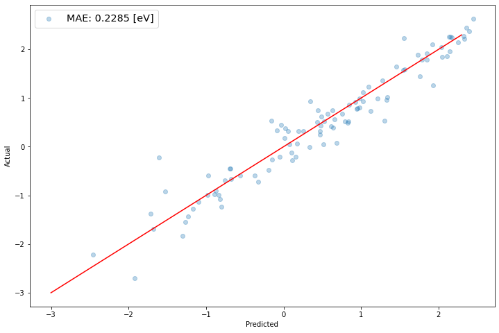

### Installing KGCNN


```python
!pip install kgcnn==0.1.0
!pip install openbabel==3.0.0a1
```

    Requirement already satisfied: kgcnn==0.1.0 in c:\users\lamsd\my_app\lib\site-packages (0.1.0)
    Requirement already satisfied: scikit-learn in c:\users\lamsd\my_app\lib\site-packages (from kgcnn==0.1.0) (1.0.1)
    Requirement already satisfied: numpy in c:\users\lamsd\my_app\lib\site-packages (from kgcnn==0.1.0) (1.22.3)
    Requirement already satisfied: pandas in c:\users\lamsd\my_app\lib\site-packages (from kgcnn==0.1.0) (1.3.4)
    Requirement already satisfied: pytz>=2017.3 in c:\users\lamsd\my_app\lib\site-packages (from pandas->kgcnn==0.1.0) (2021.3)
    Requirement already satisfied: python-dateutil>=2.7.3 in c:\users\lamsd\my_app\lib\site-packages (from pandas->kgcnn==0.1.0) (2.8.2)
    Requirement already satisfied: scipy>=1.1.0 in c:\users\lamsd\my_app\lib\site-packages (from scikit-learn->kgcnn==0.1.0) (1.7.1)
    Requirement already satisfied: threadpoolctl>=2.0.0 in c:\users\lamsd\my_app\lib\site-packages (from scikit-learn->kgcnn==0.1.0) (3.0.0)
    Requirement already satisfied: joblib>=0.11 in c:\users\lamsd\my_app\lib\site-packages (from scikit-learn->kgcnn==0.1.0) (1.1.0)
    Requirement already satisfied: six>=1.5 in c:\users\lamsd\my_app\lib\site-packages (from python-dateutil>=2.7.3->pandas->kgcnn==0.1.0) (1.15.0)
    Requirement already satisfied: openbabel==3.0.0a1 in c:\users\lamsd\my_app\lib\site-packages (3.0.0a1)
    

### Necessary imports


```python
import math
import numpy as np
import tensorflow as tf
import tensorflow.keras as ks
import matplotlib.pyplot as plt
%matplotlib inline
from sklearn.utils import shuffle
from kgcnn.data.qm.qm9 import qm9_graph
from kgcnn.literature.Megnet import getmodelMegnet,softplus2
from kgcnn.utils.learning import lr_lin_reduction
```

# BRIEF INTRODUCTION TO `RaggedTensor`

*Ragged tensors* are the TensorFlow equivalent of nested variable-length
lists. They make it easy to store and process data with non-uniform shapes,
including:

*   Variable-length features, such as the set of actors in a movie.
*   Batches of variable-length sequential inputs, such as sentences or video
    clips.
*   Hierarchical inputs, such as text documents that are subdivided into
    sections, paragraphs, sentences, and words.
*   Individual fields in structured inputs, such as protocol buffers.


### Constructing a ragged tensor

The simplest way to construct a ragged tensor is using
`tf.ragged.constant`, which builds the
`RaggedTensor` corresponding to a given nested Python `list` or numpy `array`


```python
sentences = tf.ragged.constant([
    ["Let's", "build", "some", "ragged", "tensors", "!"],
    ["We", "can", "use", "tf.ragged.constant", "."]])
print(sentences)
```

    <tf.RaggedTensor [[b"Let's", b'build', b'some', b'ragged', b'tensors', b'!'],
     [b'We', b'can', b'use', b'tf.ragged.constant', b'.']]>
    


```python
paragraphs = tf.ragged.constant([
    [['I', 'have', 'a', 'cat'], ['His', 'name', 'is', 'Mat']],
    [['Do', 'you', 'want', 'to', 'come', 'visit'], ["I'm", 'free', 'tomorrow']],
])
print(paragraphs)
```

    <tf.RaggedTensor [[[b'I', b'have', b'a', b'cat'], [b'His', b'name', b'is', b'Mat']],
     [[b'Do', b'you', b'want', b'to', b'come', b'visit'],
      [b"I'm", b'free', b'tomorrow']]]>
    

Ragged tensors can also be constructed by pairing flat *values* tensors with
*row-partitioning* tensors indicating how those values should be divided into
rows, using factory classmethods such as `tf.RaggedTensor.from_value_rowids`,
`tf.RaggedTensor.from_row_lengths`, and
`tf.RaggedTensor.from_row_splits`. View the [docs](https://www.tensorflow.org/api_docs/python/tf/RaggedTensor) to see how.

## Ragged vs. sparse

A ragged tensor should *not* be thought of as a type of sparse tensor.  In particular, sparse tensors are *efficient encodings for tf.Tensor*, that model the same data in a compact format; but ragged tensor is an *extension to tf.Tensor*, that models an expanded class of data.  This difference is crucial when defining operations:

* Applying an op to a sparse or dense tensor should always give the same result.
* Applying an op to a ragged or sparse tensor may give different results.


```python
ragged_x = tf.ragged.constant([["John"], ["a", "big", "dog"], ["my", "cat"]])
ragged_y = tf.ragged.constant([["fell", "asleep"], ["barked"], ["is", "fuzzy"]])
print(tf.concat([ragged_x, ragged_y], axis=1))
```

    <tf.RaggedTensor [[b'John', b'fell', b'asleep'], [b'a', b'big', b'dog', b'barked'],
     [b'my', b'cat', b'is', b'fuzzy']]>
    

But concatenating sparse tensors is equivalent to concatenating the corresponding dense tensors,
as illustrated by the following example (where Ø indicates missing values):


```python
sparse_x = ragged_x.to_sparse()
sparse_y = ragged_y.to_sparse()
sparse_result = tf.sparse.concat(sp_inputs=[sparse_x, sparse_y], axis=1)
print(tf.sparse.to_dense(sparse_result, ''))
```

    tf.Tensor(
    [[b'John' b'' b'' b'fell' b'asleep']
     [b'a' b'big' b'dog' b'barked' b'']
     [b'my' b'cat' b'' b'is' b'fuzzy']], shape=(3, 5), dtype=string)
    

## IMPLEMENTING MEGNet NETWORKS USING KCGNN


```python
# Download Dataset
qm9_data = qm9_graph()
y_data = qm9_data[0][:,7]*27.2114  #select LUMO in eV
x_data = qm9_data[1:]

#Scale output
y_mean = np.mean(y_data)
y_data = (np.expand_dims(y_data,axis=-1)-y_mean)  
data_unit = 'eV'
```

    Database path: C:\Users\LAMSD\my_app\Lib\site-packages\kgcnn\data\qm
    Downloading dataset...done
    Creating directory ... done
    Read Zip File ... done
    Extracting Zip folder...done
    Reading dsgdb9nsd files ...done
    Saving qm9.pickle ...done
    Clean up unzipped folder...done
    Making graph ...done
    


```python
#Make test/train split
VALSIZE = 100
TRAINSIZE = 2000
print("Training Size:",TRAINSIZE," Validation Size:",VALSIZE )
inds = np.arange(len(y_data))
inds = shuffle(inds)
ind_val = inds[:VALSIZE ]
ind_train = inds[VALSIZE:(VALSIZE + TRAINSIZE)]

# Select train/test data
xtrain = [[x[i] for i in ind_train] for x in x_data]
ytrain = y_data[ind_train]
xval = [[x[i] for i in ind_val] for x in x_data]
yval = y_data[ind_val]
```

    Training Size: 2000  Validation Size: 100
    


```python
def make_ragged(inlist):
    return tf.RaggedTensor.from_row_lengths(np.concatenate(inlist,axis=0), np.array([len(x) for x in inlist],dtype=np.int))

#Make ragged graph tensors plus normal tensor for graph state
xval = [make_ragged(x) for x in xval[:3]] + [tf.constant(xval[3])]
xtrain = [make_ragged(x) for x in xtrain[:3]] + [tf.constant(xtrain[3])]

```

    C:\Users\LAMSD\AppData\Local\Temp/ipykernel_11884/2669346059.py:2: DeprecationWarning: `np.int` is a deprecated alias for the builtin `int`. To silence this warning, use `int` by itself. Doing this will not modify any behavior and is safe. When replacing `np.int`, you may wish to use e.g. `np.int64` or `np.int32` to specify the precision. If you wish to review your current use, check the release note link for additional information.
    Deprecated in NumPy 1.20; for more details and guidance: https://numpy.org/devdocs/release/1.20.0-notes.html#deprecations
      return tf.RaggedTensor.from_row_lengths(np.concatenate(inlist,axis=0), np.array([len(x) for x in inlist],dtype=np.int))
    


```python
model =  getmodelMegnet(
                    # Input
                    input_node_shape = [None],
                    input_edge_shape = [None,20],
                    input_state_shape = [1],
                    input_node_vocab = 10,
                    input_node_embedd = 16,
                    input_edge_embedd = 16,
                    input_type = 'ragged', 
                    # Output
                    output_embedd = 'graph', #Only graph possible for megnet
                    output_use_bias = [True,True,True],
                    output_dim = [32,16,1],
                    output_activation = ['softplus2','softplus2','linear'],
                    output_type = 'padded',
                    #Model specs
                    is_sorted = True,
                    has_unconnected = False,
                    nblocks = 3,
                    n1= 64,
                    n2 = 32,
                    n3= 16,
                    set2set_dim = 16,
                    use_bias = True,
                    act = 'softplus2',
                    l2_coef = None,
                    has_ff = True,
                    dropout = None,
                    dropout_on_predict = False,
                    use_set2set = True,
                    npass= 3,
                    set2set_init = '0',
                    set2set_pool = "sum"
                    )


learning_rate_start = 0.5e-3
learning_rate_stop = 1e-5
epo = 500
epomin = 400
optimizer = tf.keras.optimizers.Adam(lr=learning_rate_start)

cbks = tf.keras.callbacks.LearningRateScheduler(lr_lin_reduction(learning_rate_start,learning_rate_stop,epomin,epo))
model.compile(loss='mean_squared_error',
              optimizer=optimizer,
              metrics=['mean_absolute_error', 'mean_squared_error'])
print(model.summary())
```

    Model: "model"
    __________________________________________________________________________________________________
     Layer (type)                   Output Shape         Param #     Connected to                     
    ==================================================================================================
     node_input (InputLayer)        [(None, None)]       0           []                               
                                                                                                      
     node_embedding (Embedding)     (None, None, 16)     160         ['node_input[0][0]']             
                                                                                                      
     edge_input (InputLayer)        [(None, None, 20)]   0           []                               
                                                                                                      
     edge_index_input (InputLayer)  [(None, None, 2)]    0           []                               
                                                                                                      
     cast_ragged_to_disjoint (CastR  [(None, 16),        0           ['node_embedding[0][0]',         
     aggedToDisjoint)                (None,),                         'edge_input[0][0]',             
                                     (None, 20),                      'edge_index_input[0][0]']       
                                     (None,),                                                         
                                     (None, 2)]                                                       
                                                                                                      
     state_input (InputLayer)       [(None, 1)]          0           []                               
                                                                                                      
     dense (Dense)                  (None, 64)           1088        ['cast_ragged_to_disjoint[0][0]']
                                                                                                      
     dense_2 (Dense)                (None, 64)           1344        ['cast_ragged_to_disjoint[0][2]']
                                                                                                      
     dense_4 (Dense)                (None, 64)           128         ['state_input[0][0]']            
                                                                                                      
     dense_1 (Dense)                (None, 32)           2080        ['dense[0][0]']                  
                                                                                                      
     dense_3 (Dense)                (None, 32)           2080        ['dense_2[0][0]']                
                                                                                                      
     dense_5 (Dense)                (None, 32)           2080        ['dense_4[0][0]']                
                                                                                                      
     megnet_0 (MEGnetBlock)         ((None, 32),         39392       ['dense_1[0][0]',                
                                     (None, 32),                      'dense_3[0][0]',                
                                     (None, 32))                      'cast_ragged_to_disjoint[0][4]',
                                                                      'dense_5[0][0]',                
                                                                      'cast_ragged_to_disjoint[0][1]',
                                                                      'cast_ragged_to_disjoint[0][3]']
                                                                                                      
     add (Add)                      (None, 32)           0           ['megnet_0[0][0]',               
                                                                      'dense_1[0][0]']                
                                                                                                      
     add_2 (Add)                    (None, 32)           0           ['megnet_0[0][1]',               
                                                                      'dense_3[0][0]']                
                                                                                                      
     add_1 (Add)                    (None, 32)           0           ['megnet_0[0][2]',               
                                                                      'dense_5[0][0]']                
                                                                                                      
     dense_15 (Dense)               (None, 64)           2112        ['add[0][0]']                    
                                                                                                      
     dense_17 (Dense)               (None, 64)           2112        ['add_2[0][0]']                  
                                                                                                      
     dense_19 (Dense)               (None, 64)           2112        ['add_1[0][0]']                  
                                                                                                      
     dense_16 (Dense)               (None, 32)           2080        ['dense_15[0][0]']               
                                                                                                      
     dense_18 (Dense)               (None, 32)           2080        ['dense_17[0][0]']               
                                                                                                      
     dense_20 (Dense)               (None, 32)           2080        ['dense_19[0][0]']               
                                                                                                      
     megnet_1 (MEGnetBlock)         ((None, 32),         39392       ['dense_16[0][0]',               
                                     (None, 32),                      'dense_18[0][0]',               
                                     (None, 32))                      'cast_ragged_to_disjoint[0][4]',
                                                                      'dense_20[0][0]',               
                                                                      'cast_ragged_to_disjoint[0][1]',
                                                                      'cast_ragged_to_disjoint[0][3]']
                                                                                                      
     add_3 (Add)                    (None, 32)           0           ['megnet_1[0][0]',               
                                                                      'add[0][0]']                    
                                                                                                      
     add_5 (Add)                    (None, 32)           0           ['megnet_1[0][1]',               
                                                                      'add_2[0][0]']                  
                                                                                                      
     add_4 (Add)                    (None, 32)           0           ['megnet_1[0][2]',               
                                                                      'add_1[0][0]']                  
                                                                                                      
     dense_30 (Dense)               (None, 64)           2112        ['add_3[0][0]']                  
                                                                                                      
     dense_32 (Dense)               (None, 64)           2112        ['add_5[0][0]']                  
                                                                                                      
     dense_34 (Dense)               (None, 64)           2112        ['add_4[0][0]']                  
                                                                                                      
     dense_31 (Dense)               (None, 32)           2080        ['dense_30[0][0]']               
                                                                                                      
     dense_33 (Dense)               (None, 32)           2080        ['dense_32[0][0]']               
                                                                                                      
     dense_35 (Dense)               (None, 32)           2080        ['dense_34[0][0]']               
                                                                                                      
     megnet_2 (MEGnetBlock)         ((None, 32),         39392       ['dense_31[0][0]',               
                                     (None, 32),                      'dense_33[0][0]',               
                                     (None, 32))                      'cast_ragged_to_disjoint[0][4]',
                                                                      'dense_35[0][0]',               
                                                                      'cast_ragged_to_disjoint[0][1]',
                                                                      'cast_ragged_to_disjoint[0][3]']
                                                                                                      
     add_6 (Add)                    (None, 32)           0           ['megnet_2[0][0]',               
                                                                      'add_3[0][0]']                  
                                                                                                      
     add_8 (Add)                    (None, 32)           0           ['megnet_2[0][1]',               
                                                                      'add_5[0][0]']                  
                                                                                                      
     dense_45 (Dense)               (None, 16)           528         ['add_6[0][0]']                  
                                                                                                      
     dense_46 (Dense)               (None, 16)           528         ['add_8[0][0]']                  
                                                                                                      
     set2_set (Set2Set)             (None, 1, 32)        3136        ['dense_45[0][0]',               
                                                                      'cast_ragged_to_disjoint[0][1]']
                                                                                                      
     set2_set_1 (Set2Set)           (None, 1, 32)        3136        ['dense_46[0][0]',               
                                                                      'cast_ragged_to_disjoint[0][3]']
                                                                                                      
     flatten_1 (Flatten)            (None, 32)           0           ['set2_set[0][0]']               
                                                                                                      
     flatten (Flatten)              (None, 32)           0           ['set2_set_1[0][0]']             
                                                                                                      
     add_7 (Add)                    (None, 32)           0           ['megnet_2[0][2]',               
                                                                      'add_4[0][0]']                  
                                                                                                      
     concatenate_9 (Concatenate)    (None, 96)           0           ['flatten_1[0][0]',              
                                                                      'flatten[0][0]',                
                                                                      'add_7[0][0]']                  
                                                                                                      
     mlp (MLP)                      (None, 1)            3649        ['concatenate_9[0][0]']          
                                                                                                      
    ==================================================================================================
    Total params: 163,265
    Trainable params: 163,265
    Non-trainable params: 0
    __________________________________________________________________________________________________
    None
    

    C:\Users\LAMSD\my_app\lib\site-packages\keras\optimizer_v2\adam.py:105: UserWarning: The `lr` argument is deprecated, use `learning_rate` instead.
      super(Adam, self).__init__(name, **kwargs)
    


```python
trainlossall = []
testlossall = []
validlossall = []

epostep = 10

hist = model.fit(xtrain, ytrain, 
          epochs=epo,
          batch_size=64,
          callbacks=[cbks],
          validation_freq=epostep,
          validation_data=(xval,yval),
          verbose=2
          )

trainlossall = hist.history['mean_absolute_error']
testlossall = hist.history['val_mean_absolute_error']


trainlossall =np.array(trainlossall)
testlossall = np.array(testlossall)

mae_valid = np.mean(np.abs(yval-model.predict(xval)))
```

    Epoch 1/500
    

    C:\Users\LAMSD\my_app\lib\site-packages\tensorflow\python\framework\indexed_slices.py:444: UserWarning: Converting sparse IndexedSlices(IndexedSlices(indices=Tensor("gradient_tape/model/megnet_2/gather_nodes_2/Reshape_1:0", shape=(None,), dtype=int64), values=Tensor("gradient_tape/model/megnet_2/gather_nodes_2/Reshape:0", shape=(None, 32), dtype=float32), dense_shape=Tensor("gradient_tape/model/megnet_2/gather_nodes_2/Cast:0", shape=(2,), dtype=int32))) to a dense Tensor of unknown shape. This may consume a large amount of memory.
      warnings.warn(
    C:\Users\LAMSD\my_app\lib\site-packages\tensorflow\python\framework\indexed_slices.py:444: UserWarning: Converting sparse IndexedSlices(IndexedSlices(indices=Tensor("gradient_tape/model/megnet_2/gather_nodes_2/Reshape_3:0", shape=(None,), dtype=int64), values=Tensor("gradient_tape/model/megnet_2/gather_nodes_2/Reshape_2:0", shape=(None, 32), dtype=float32), dense_shape=Tensor("gradient_tape/model/megnet_2/gather_nodes_2/Cast_1:0", shape=(2,), dtype=int32))) to a dense Tensor of unknown shape. This may consume a large amount of memory.
      warnings.warn(
    C:\Users\LAMSD\my_app\lib\site-packages\tensorflow\python\framework\indexed_slices.py:444: UserWarning: Converting sparse IndexedSlices(IndexedSlices(indices=Tensor("gradient_tape/model/megnet_1/gather_nodes_1/Reshape_1:0", shape=(None,), dtype=int64), values=Tensor("gradient_tape/model/megnet_1/gather_nodes_1/Reshape:0", shape=(None, 32), dtype=float32), dense_shape=Tensor("gradient_tape/model/megnet_1/gather_nodes_1/Cast:0", shape=(2,), dtype=int32))) to a dense Tensor of unknown shape. This may consume a large amount of memory.
      warnings.warn(
    C:\Users\LAMSD\my_app\lib\site-packages\tensorflow\python\framework\indexed_slices.py:444: UserWarning: Converting sparse IndexedSlices(IndexedSlices(indices=Tensor("gradient_tape/model/megnet_1/gather_nodes_1/Reshape_3:0", shape=(None,), dtype=int64), values=Tensor("gradient_tape/model/megnet_1/gather_nodes_1/Reshape_2:0", shape=(None, 32), dtype=float32), dense_shape=Tensor("gradient_tape/model/megnet_1/gather_nodes_1/Cast_1:0", shape=(2,), dtype=int32))) to a dense Tensor of unknown shape. This may consume a large amount of memory.
      warnings.warn(
    C:\Users\LAMSD\my_app\lib\site-packages\tensorflow\python\framework\indexed_slices.py:444: UserWarning: Converting sparse IndexedSlices(IndexedSlices(indices=Tensor("gradient_tape/model/megnet_0/gather_nodes/Reshape_1:0", shape=(None,), dtype=int64), values=Tensor("gradient_tape/model/megnet_0/gather_nodes/Reshape:0", shape=(None, 32), dtype=float32), dense_shape=Tensor("gradient_tape/model/megnet_0/gather_nodes/Cast:0", shape=(2,), dtype=int32))) to a dense Tensor of unknown shape. This may consume a large amount of memory.
      warnings.warn(
    C:\Users\LAMSD\my_app\lib\site-packages\tensorflow\python\framework\indexed_slices.py:444: UserWarning: Converting sparse IndexedSlices(IndexedSlices(indices=Tensor("gradient_tape/model/megnet_0/gather_nodes/Reshape_3:0", shape=(None,), dtype=int64), values=Tensor("gradient_tape/model/megnet_0/gather_nodes/Reshape_2:0", shape=(None, 32), dtype=float32), dense_shape=Tensor("gradient_tape/model/megnet_0/gather_nodes/Cast_1:0", shape=(2,), dtype=int32))) to a dense Tensor of unknown shape. This may consume a large amount of memory.
      warnings.warn(
    

    32/32 - 27s - loss: 1.2447 - mean_absolute_error: 0.9120 - mean_squared_error: 1.2447 - lr: 5.0000e-04 - 27s/epoch - 856ms/step
    Epoch 2/500
    32/32 - 2s - loss: 0.8854 - mean_absolute_error: 0.7709 - mean_squared_error: 0.8854 - lr: 5.0000e-04 - 2s/epoch - 74ms/step
    Epoch 3/500
    32/32 - 2s - loss: 0.8866 - mean_absolute_error: 0.7703 - mean_squared_error: 0.8866 - lr: 5.0000e-04 - 2s/epoch - 76ms/step
    Epoch 4/500
    32/32 - 3s - loss: 0.8842 - mean_absolute_error: 0.7691 - mean_squared_error: 0.8842 - lr: 5.0000e-04 - 3s/epoch - 78ms/step
    Epoch 5/500
    32/32 - 3s - loss: 0.8947 - mean_absolute_error: 0.7743 - mean_squared_error: 0.8947 - lr: 5.0000e-04 - 3s/epoch - 78ms/step
    Epoch 6/500
    32/32 - 2s - loss: 0.8924 - mean_absolute_error: 0.7723 - mean_squared_error: 0.8924 - lr: 5.0000e-04 - 2s/epoch - 78ms/step
    Epoch 7/500
    32/32 - 2s - loss: 0.8854 - mean_absolute_error: 0.7696 - mean_squared_error: 0.8854 - lr: 5.0000e-04 - 2s/epoch - 78ms/step
    Epoch 8/500
    32/32 - 2s - loss: 0.8871 - mean_absolute_error: 0.7706 - mean_squared_error: 0.8871 - lr: 5.0000e-04 - 2s/epoch - 77ms/step
    Epoch 9/500
    32/32 - 3s - loss: 0.8940 - mean_absolute_error: 0.7722 - mean_squared_error: 0.8940 - lr: 5.0000e-04 - 3s/epoch - 78ms/step
    Epoch 10/500
    32/32 - 5s - loss: 0.8809 - mean_absolute_error: 0.7690 - mean_squared_error: 0.8809 - val_loss: 0.8954 - val_mean_absolute_error: 0.7520 - val_mean_squared_error: 0.8954 - lr: 5.0000e-04 - 5s/epoch - 170ms/step
    Epoch 11/500
    32/32 - 3s - loss: 0.8794 - mean_absolute_error: 0.7690 - mean_squared_error: 0.8794 - lr: 5.0000e-04 - 3s/epoch - 84ms/step
    Epoch 12/500
    32/32 - 2s - loss: 0.8797 - mean_absolute_error: 0.7671 - mean_squared_error: 0.8797 - lr: 5.0000e-04 - 2s/epoch - 76ms/step
    Epoch 13/500
    32/32 - 2s - loss: 0.8685 - mean_absolute_error: 0.7630 - mean_squared_error: 0.8685 - lr: 5.0000e-04 - 2s/epoch - 76ms/step
    Epoch 14/500
    32/32 - 2s - loss: 0.8607 - mean_absolute_error: 0.7574 - mean_squared_error: 0.8607 - lr: 5.0000e-04 - 2s/epoch - 77ms/step
    Epoch 15/500
    32/32 - 2s - loss: 0.8412 - mean_absolute_error: 0.7478 - mean_squared_error: 0.8412 - lr: 5.0000e-04 - 2s/epoch - 76ms/step
    Epoch 16/500
    32/32 - 2s - loss: 0.8207 - mean_absolute_error: 0.7414 - mean_squared_error: 0.8207 - lr: 5.0000e-04 - 2s/epoch - 78ms/step
    Epoch 17/500
    32/32 - 2s - loss: 0.8053 - mean_absolute_error: 0.7307 - mean_squared_error: 0.8053 - lr: 5.0000e-04 - 2s/epoch - 76ms/step
    Epoch 18/500
    32/32 - 2s - loss: 0.8419 - mean_absolute_error: 0.7496 - mean_squared_error: 0.8419 - lr: 5.0000e-04 - 2s/epoch - 76ms/step
    Epoch 19/500
    32/32 - 2s - loss: 0.8041 - mean_absolute_error: 0.7336 - mean_squared_error: 0.8041 - lr: 5.0000e-04 - 2s/epoch - 76ms/step
    Epoch 20/500
    32/32 - 3s - loss: 0.7904 - mean_absolute_error: 0.7291 - mean_squared_error: 0.7904 - val_loss: 0.7540 - val_mean_absolute_error: 0.6977 - val_mean_squared_error: 0.7540 - lr: 5.0000e-04 - 3s/epoch - 79ms/step
    Epoch 21/500
    32/32 - 2s - loss: 0.7722 - mean_absolute_error: 0.7208 - mean_squared_error: 0.7722 - lr: 5.0000e-04 - 2s/epoch - 77ms/step
    Epoch 22/500
    32/32 - 3s - loss: 0.8119 - mean_absolute_error: 0.7346 - mean_squared_error: 0.8119 - lr: 5.0000e-04 - 3s/epoch - 78ms/step
    Epoch 23/500
    32/32 - 2s - loss: 0.8056 - mean_absolute_error: 0.7344 - mean_squared_error: 0.8056 - lr: 5.0000e-04 - 2s/epoch - 77ms/step
    Epoch 24/500
    32/32 - 2s - loss: 0.7625 - mean_absolute_error: 0.7127 - mean_squared_error: 0.7625 - lr: 5.0000e-04 - 2s/epoch - 76ms/step
    Epoch 25/500
    32/32 - 2s - loss: 0.8082 - mean_absolute_error: 0.7357 - mean_squared_error: 0.8082 - lr: 5.0000e-04 - 2s/epoch - 76ms/step
    Epoch 26/500
    32/32 - 2s - loss: 0.7623 - mean_absolute_error: 0.7216 - mean_squared_error: 0.7623 - lr: 5.0000e-04 - 2s/epoch - 76ms/step
    Epoch 27/500
    32/32 - 2s - loss: 0.7337 - mean_absolute_error: 0.7025 - mean_squared_error: 0.7337 - lr: 5.0000e-04 - 2s/epoch - 76ms/step
    Epoch 28/500
    32/32 - 3s - loss: 0.7066 - mean_absolute_error: 0.6903 - mean_squared_error: 0.7066 - lr: 5.0000e-04 - 3s/epoch - 78ms/step
    Epoch 29/500
    32/32 - 2s - loss: 0.6958 - mean_absolute_error: 0.6847 - mean_squared_error: 0.6958 - lr: 5.0000e-04 - 2s/epoch - 78ms/step
    Epoch 30/500
    32/32 - 3s - loss: 0.7035 - mean_absolute_error: 0.6845 - mean_squared_error: 0.7035 - val_loss: 0.5730 - val_mean_absolute_error: 0.6543 - val_mean_squared_error: 0.5730 - lr: 5.0000e-04 - 3s/epoch - 79ms/step
    Epoch 31/500
    32/32 - 2s - loss: 0.6421 - mean_absolute_error: 0.6577 - mean_squared_error: 0.6421 - lr: 5.0000e-04 - 2s/epoch - 77ms/step
    Epoch 32/500
    32/32 - 2s - loss: 0.6313 - mean_absolute_error: 0.6525 - mean_squared_error: 0.6313 - lr: 5.0000e-04 - 2s/epoch - 77ms/step
    Epoch 33/500
    32/32 - 2s - loss: 0.6530 - mean_absolute_error: 0.6590 - mean_squared_error: 0.6530 - lr: 5.0000e-04 - 2s/epoch - 78ms/step
    Epoch 34/500
    32/32 - 2s - loss: 0.5834 - mean_absolute_error: 0.6239 - mean_squared_error: 0.5834 - lr: 5.0000e-04 - 2s/epoch - 77ms/step
    Epoch 35/500
    32/32 - 2s - loss: 0.5620 - mean_absolute_error: 0.6138 - mean_squared_error: 0.5620 - lr: 5.0000e-04 - 2s/epoch - 78ms/step
    Epoch 36/500
    32/32 - 2s - loss: 0.5781 - mean_absolute_error: 0.6185 - mean_squared_error: 0.5781 - lr: 5.0000e-04 - 2s/epoch - 78ms/step
    Epoch 37/500
    32/32 - 2s - loss: 0.5394 - mean_absolute_error: 0.5959 - mean_squared_error: 0.5394 - lr: 5.0000e-04 - 2s/epoch - 78ms/step
    Epoch 38/500
    32/32 - 3s - loss: 0.5380 - mean_absolute_error: 0.5937 - mean_squared_error: 0.5380 - lr: 5.0000e-04 - 3s/epoch - 79ms/step
    Epoch 39/500
    32/32 - 2s - loss: 0.5416 - mean_absolute_error: 0.6021 - mean_squared_error: 0.5416 - lr: 5.0000e-04 - 2s/epoch - 78ms/step
    Epoch 40/500
    32/32 - 3s - loss: 0.5355 - mean_absolute_error: 0.5947 - mean_squared_error: 0.5355 - val_loss: 0.4320 - val_mean_absolute_error: 0.5481 - val_mean_squared_error: 0.4320 - lr: 5.0000e-04 - 3s/epoch - 79ms/step
    Epoch 41/500
    32/32 - 2s - loss: 0.5031 - mean_absolute_error: 0.5733 - mean_squared_error: 0.5031 - lr: 5.0000e-04 - 2s/epoch - 78ms/step
    Epoch 42/500
    32/32 - 2s - loss: 0.4974 - mean_absolute_error: 0.5621 - mean_squared_error: 0.4974 - lr: 5.0000e-04 - 2s/epoch - 78ms/step
    Epoch 43/500
    32/32 - 3s - loss: 0.4743 - mean_absolute_error: 0.5474 - mean_squared_error: 0.4743 - lr: 5.0000e-04 - 3s/epoch - 80ms/step
    Epoch 44/500
    32/32 - 3s - loss: 0.4538 - mean_absolute_error: 0.5347 - mean_squared_error: 0.4538 - lr: 5.0000e-04 - 3s/epoch - 79ms/step
    Epoch 45/500
    32/32 - 3s - loss: 0.4647 - mean_absolute_error: 0.5426 - mean_squared_error: 0.4647 - lr: 5.0000e-04 - 3s/epoch - 78ms/step
    Epoch 46/500
    32/32 - 3s - loss: 0.4358 - mean_absolute_error: 0.5187 - mean_squared_error: 0.4358 - lr: 5.0000e-04 - 3s/epoch - 78ms/step
    Epoch 47/500
    32/32 - 3s - loss: 0.4968 - mean_absolute_error: 0.5588 - mean_squared_error: 0.4968 - lr: 5.0000e-04 - 3s/epoch - 79ms/step
    Epoch 48/500
    32/32 - 3s - loss: 0.4473 - mean_absolute_error: 0.5265 - mean_squared_error: 0.4473 - lr: 5.0000e-04 - 3s/epoch - 79ms/step
    Epoch 49/500
    32/32 - 3s - loss: 0.4336 - mean_absolute_error: 0.5173 - mean_squared_error: 0.4336 - lr: 5.0000e-04 - 3s/epoch - 78ms/step
    Epoch 50/500
    32/32 - 3s - loss: 0.4130 - mean_absolute_error: 0.5010 - mean_squared_error: 0.4130 - val_loss: 0.3950 - val_mean_absolute_error: 0.5292 - val_mean_squared_error: 0.3950 - lr: 5.0000e-04 - 3s/epoch - 80ms/step
    Epoch 51/500
    32/32 - 3s - loss: 0.4268 - mean_absolute_error: 0.5116 - mean_squared_error: 0.4268 - lr: 5.0000e-04 - 3s/epoch - 78ms/step
    Epoch 52/500
    32/32 - 3s - loss: 0.4175 - mean_absolute_error: 0.5096 - mean_squared_error: 0.4175 - lr: 5.0000e-04 - 3s/epoch - 80ms/step
    Epoch 53/500
    32/32 - 2s - loss: 0.4203 - mean_absolute_error: 0.5076 - mean_squared_error: 0.4203 - lr: 5.0000e-04 - 2s/epoch - 78ms/step
    Epoch 54/500
    32/32 - 3s - loss: 0.3940 - mean_absolute_error: 0.4842 - mean_squared_error: 0.3940 - lr: 5.0000e-04 - 3s/epoch - 79ms/step
    Epoch 55/500
    32/32 - 3s - loss: 0.4002 - mean_absolute_error: 0.4978 - mean_squared_error: 0.4002 - lr: 5.0000e-04 - 3s/epoch - 79ms/step
    Epoch 56/500
    32/32 - 3s - loss: 0.3878 - mean_absolute_error: 0.4839 - mean_squared_error: 0.3878 - lr: 5.0000e-04 - 3s/epoch - 79ms/step
    Epoch 57/500
    32/32 - 3s - loss: 0.3852 - mean_absolute_error: 0.4835 - mean_squared_error: 0.3852 - lr: 5.0000e-04 - 3s/epoch - 81ms/step
    Epoch 58/500
    32/32 - 3s - loss: 0.3712 - mean_absolute_error: 0.4743 - mean_squared_error: 0.3712 - lr: 5.0000e-04 - 3s/epoch - 79ms/step
    Epoch 59/500
    32/32 - 3s - loss: 0.3815 - mean_absolute_error: 0.4739 - mean_squared_error: 0.3815 - lr: 5.0000e-04 - 3s/epoch - 79ms/step
    Epoch 60/500
    32/32 - 3s - loss: 0.3658 - mean_absolute_error: 0.4698 - mean_squared_error: 0.3658 - val_loss: 0.2957 - val_mean_absolute_error: 0.4227 - val_mean_squared_error: 0.2957 - lr: 5.0000e-04 - 3s/epoch - 81ms/step
    Epoch 61/500
    32/32 - 3s - loss: 0.3644 - mean_absolute_error: 0.4611 - mean_squared_error: 0.3644 - lr: 5.0000e-04 - 3s/epoch - 80ms/step
    Epoch 62/500
    32/32 - 3s - loss: 0.3768 - mean_absolute_error: 0.4768 - mean_squared_error: 0.3768 - lr: 5.0000e-04 - 3s/epoch - 78ms/step
    Epoch 63/500
    32/32 - 3s - loss: 0.3707 - mean_absolute_error: 0.4715 - mean_squared_error: 0.3707 - lr: 5.0000e-04 - 3s/epoch - 79ms/step
    Epoch 64/500
    32/32 - 3s - loss: 0.3751 - mean_absolute_error: 0.4739 - mean_squared_error: 0.3751 - lr: 5.0000e-04 - 3s/epoch - 79ms/step
    Epoch 65/500
    32/32 - 3s - loss: 0.3534 - mean_absolute_error: 0.4584 - mean_squared_error: 0.3534 - lr: 5.0000e-04 - 3s/epoch - 78ms/step
    Epoch 66/500
    32/32 - 3s - loss: 0.3649 - mean_absolute_error: 0.4670 - mean_squared_error: 0.3649 - lr: 5.0000e-04 - 3s/epoch - 79ms/step
    Epoch 67/500
    32/32 - 3s - loss: 0.3428 - mean_absolute_error: 0.4513 - mean_squared_error: 0.3428 - lr: 5.0000e-04 - 3s/epoch - 79ms/step
    Epoch 68/500
    32/32 - 2s - loss: 0.3332 - mean_absolute_error: 0.4482 - mean_squared_error: 0.3332 - lr: 5.0000e-04 - 2s/epoch - 78ms/step
    Epoch 69/500
    32/32 - 2s - loss: 0.3304 - mean_absolute_error: 0.4430 - mean_squared_error: 0.3304 - lr: 5.0000e-04 - 2s/epoch - 78ms/step
    Epoch 70/500
    32/32 - 3s - loss: 0.3446 - mean_absolute_error: 0.4517 - mean_squared_error: 0.3446 - val_loss: 0.2972 - val_mean_absolute_error: 0.4298 - val_mean_squared_error: 0.2972 - lr: 5.0000e-04 - 3s/epoch - 82ms/step
    Epoch 71/500
    32/32 - 3s - loss: 0.3307 - mean_absolute_error: 0.4446 - mean_squared_error: 0.3307 - lr: 5.0000e-04 - 3s/epoch - 79ms/step
    Epoch 72/500
    32/32 - 2s - loss: 0.3355 - mean_absolute_error: 0.4469 - mean_squared_error: 0.3355 - lr: 5.0000e-04 - 2s/epoch - 78ms/step
    Epoch 73/500
    32/32 - 2s - loss: 0.3369 - mean_absolute_error: 0.4493 - mean_squared_error: 0.3369 - lr: 5.0000e-04 - 2s/epoch - 78ms/step
    Epoch 74/500
    32/32 - 3s - loss: 0.3086 - mean_absolute_error: 0.4289 - mean_squared_error: 0.3086 - lr: 5.0000e-04 - 3s/epoch - 80ms/step
    Epoch 75/500
    32/32 - 2s - loss: 0.3322 - mean_absolute_error: 0.4442 - mean_squared_error: 0.3322 - lr: 5.0000e-04 - 2s/epoch - 78ms/step
    Epoch 76/500
    32/32 - 3s - loss: 0.3322 - mean_absolute_error: 0.4447 - mean_squared_error: 0.3322 - lr: 5.0000e-04 - 3s/epoch - 78ms/step
    Epoch 77/500
    32/32 - 3s - loss: 0.3250 - mean_absolute_error: 0.4361 - mean_squared_error: 0.3250 - lr: 5.0000e-04 - 3s/epoch - 78ms/step
    Epoch 78/500
    32/32 - 3s - loss: 0.3371 - mean_absolute_error: 0.4514 - mean_squared_error: 0.3371 - lr: 5.0000e-04 - 3s/epoch - 79ms/step
    Epoch 79/500
    32/32 - 3s - loss: 0.3324 - mean_absolute_error: 0.4410 - mean_squared_error: 0.3324 - lr: 5.0000e-04 - 3s/epoch - 79ms/step
    Epoch 80/500
    32/32 - 3s - loss: 0.3015 - mean_absolute_error: 0.4209 - mean_squared_error: 0.3015 - val_loss: 0.2887 - val_mean_absolute_error: 0.4204 - val_mean_squared_error: 0.2887 - lr: 5.0000e-04 - 3s/epoch - 81ms/step
    Epoch 81/500
    32/32 - 3s - loss: 0.2863 - mean_absolute_error: 0.4142 - mean_squared_error: 0.2863 - lr: 5.0000e-04 - 3s/epoch - 78ms/step
    Epoch 82/500
    32/32 - 2s - loss: 0.3126 - mean_absolute_error: 0.4279 - mean_squared_error: 0.3126 - lr: 5.0000e-04 - 2s/epoch - 78ms/step
    Epoch 83/500
    32/32 - 3s - loss: 0.3103 - mean_absolute_error: 0.4310 - mean_squared_error: 0.3103 - lr: 5.0000e-04 - 3s/epoch - 80ms/step
    Epoch 84/500
    32/32 - 3s - loss: 0.3322 - mean_absolute_error: 0.4407 - mean_squared_error: 0.3322 - lr: 5.0000e-04 - 3s/epoch - 79ms/step
    Epoch 85/500
    32/32 - 3s - loss: 0.2990 - mean_absolute_error: 0.4224 - mean_squared_error: 0.2990 - lr: 5.0000e-04 - 3s/epoch - 78ms/step
    Epoch 86/500
    32/32 - 3s - loss: 0.2841 - mean_absolute_error: 0.4094 - mean_squared_error: 0.2841 - lr: 5.0000e-04 - 3s/epoch - 78ms/step
    Epoch 87/500
    32/32 - 3s - loss: 0.2726 - mean_absolute_error: 0.3977 - mean_squared_error: 0.2726 - lr: 5.0000e-04 - 3s/epoch - 79ms/step
    Epoch 88/500
    32/32 - 3s - loss: 0.2800 - mean_absolute_error: 0.4088 - mean_squared_error: 0.2800 - lr: 5.0000e-04 - 3s/epoch - 81ms/step
    Epoch 89/500
    32/32 - 3s - loss: 0.2627 - mean_absolute_error: 0.3913 - mean_squared_error: 0.2627 - lr: 5.0000e-04 - 3s/epoch - 78ms/step
    Epoch 90/500
    32/32 - 3s - loss: 0.3070 - mean_absolute_error: 0.4238 - mean_squared_error: 0.3070 - val_loss: 0.2330 - val_mean_absolute_error: 0.3741 - val_mean_squared_error: 0.2330 - lr: 5.0000e-04 - 3s/epoch - 81ms/step
    Epoch 91/500
    32/32 - 3s - loss: 0.3064 - mean_absolute_error: 0.4217 - mean_squared_error: 0.3064 - lr: 5.0000e-04 - 3s/epoch - 79ms/step
    Epoch 92/500
    32/32 - 3s - loss: 0.2928 - mean_absolute_error: 0.4161 - mean_squared_error: 0.2928 - lr: 5.0000e-04 - 3s/epoch - 80ms/step
    Epoch 93/500
    32/32 - 3s - loss: 0.2633 - mean_absolute_error: 0.3942 - mean_squared_error: 0.2633 - lr: 5.0000e-04 - 3s/epoch - 78ms/step
    Epoch 94/500
    32/32 - 2s - loss: 0.2558 - mean_absolute_error: 0.3846 - mean_squared_error: 0.2558 - lr: 5.0000e-04 - 2s/epoch - 78ms/step
    Epoch 95/500
    32/32 - 2s - loss: 0.2524 - mean_absolute_error: 0.3820 - mean_squared_error: 0.2524 - lr: 5.0000e-04 - 2s/epoch - 77ms/step
    Epoch 96/500
    32/32 - 3s - loss: 0.2383 - mean_absolute_error: 0.3721 - mean_squared_error: 0.2383 - lr: 5.0000e-04 - 3s/epoch - 78ms/step
    Epoch 97/500
    32/32 - 3s - loss: 0.2526 - mean_absolute_error: 0.3858 - mean_squared_error: 0.2526 - lr: 5.0000e-04 - 3s/epoch - 79ms/step
    Epoch 98/500
    32/32 - 2s - loss: 0.2474 - mean_absolute_error: 0.3818 - mean_squared_error: 0.2474 - lr: 5.0000e-04 - 2s/epoch - 78ms/step
    Epoch 99/500
    32/32 - 3s - loss: 0.2694 - mean_absolute_error: 0.4023 - mean_squared_error: 0.2694 - lr: 5.0000e-04 - 3s/epoch - 78ms/step
    Epoch 100/500
    32/32 - 3s - loss: 0.2460 - mean_absolute_error: 0.3754 - mean_squared_error: 0.2460 - val_loss: 0.1705 - val_mean_absolute_error: 0.3207 - val_mean_squared_error: 0.1705 - lr: 5.0000e-04 - 3s/epoch - 80ms/step
    Epoch 101/500
    32/32 - 2s - loss: 0.2798 - mean_absolute_error: 0.4060 - mean_squared_error: 0.2798 - lr: 5.0000e-04 - 2s/epoch - 78ms/step
    Epoch 102/500
    32/32 - 3s - loss: 0.2297 - mean_absolute_error: 0.3668 - mean_squared_error: 0.2297 - lr: 5.0000e-04 - 3s/epoch - 80ms/step
    Epoch 103/500
    32/32 - 2s - loss: 0.2274 - mean_absolute_error: 0.3617 - mean_squared_error: 0.2274 - lr: 5.0000e-04 - 2s/epoch - 78ms/step
    Epoch 104/500
    32/32 - 2s - loss: 0.2451 - mean_absolute_error: 0.3738 - mean_squared_error: 0.2451 - lr: 5.0000e-04 - 2s/epoch - 77ms/step
    Epoch 105/500
    32/32 - 2s - loss: 0.2345 - mean_absolute_error: 0.3700 - mean_squared_error: 0.2345 - lr: 5.0000e-04 - 2s/epoch - 78ms/step
    Epoch 106/500
    32/32 - 2s - loss: 0.2314 - mean_absolute_error: 0.3700 - mean_squared_error: 0.2314 - lr: 5.0000e-04 - 2s/epoch - 78ms/step
    Epoch 107/500
    32/32 - 3s - loss: 0.2231 - mean_absolute_error: 0.3586 - mean_squared_error: 0.2231 - lr: 5.0000e-04 - 3s/epoch - 79ms/step
    Epoch 108/500
    32/32 - 3s - loss: 0.2246 - mean_absolute_error: 0.3581 - mean_squared_error: 0.2246 - lr: 5.0000e-04 - 3s/epoch - 79ms/step
    Epoch 109/500
    32/32 - 2s - loss: 0.2566 - mean_absolute_error: 0.3810 - mean_squared_error: 0.2566 - lr: 5.0000e-04 - 2s/epoch - 78ms/step
    Epoch 110/500
    32/32 - 3s - loss: 0.2724 - mean_absolute_error: 0.4011 - mean_squared_error: 0.2724 - val_loss: 0.1967 - val_mean_absolute_error: 0.3259 - val_mean_squared_error: 0.1967 - lr: 5.0000e-04 - 3s/epoch - 80ms/step
    Epoch 111/500
    32/32 - 2s - loss: 0.2364 - mean_absolute_error: 0.3688 - mean_squared_error: 0.2364 - lr: 5.0000e-04 - 2s/epoch - 78ms/step
    Epoch 112/500
    32/32 - 3s - loss: 0.2520 - mean_absolute_error: 0.3829 - mean_squared_error: 0.2520 - lr: 5.0000e-04 - 3s/epoch - 79ms/step
    Epoch 113/500
    32/32 - 2s - loss: 0.2281 - mean_absolute_error: 0.3570 - mean_squared_error: 0.2281 - lr: 5.0000e-04 - 2s/epoch - 78ms/step
    Epoch 114/500
    32/32 - 3s - loss: 0.1954 - mean_absolute_error: 0.3358 - mean_squared_error: 0.1954 - lr: 5.0000e-04 - 3s/epoch - 78ms/step
    Epoch 115/500
    32/32 - 3s - loss: 0.1923 - mean_absolute_error: 0.3342 - mean_squared_error: 0.1923 - lr: 5.0000e-04 - 3s/epoch - 79ms/step
    Epoch 116/500
    32/32 - 3s - loss: 0.2036 - mean_absolute_error: 0.3398 - mean_squared_error: 0.2036 - lr: 5.0000e-04 - 3s/epoch - 78ms/step
    Epoch 117/500
    32/32 - 3s - loss: 0.1954 - mean_absolute_error: 0.3330 - mean_squared_error: 0.1954 - lr: 5.0000e-04 - 3s/epoch - 80ms/step
    Epoch 118/500
    32/32 - 3s - loss: 0.2064 - mean_absolute_error: 0.3429 - mean_squared_error: 0.2064 - lr: 5.0000e-04 - 3s/epoch - 79ms/step
    Epoch 119/500
    32/32 - 2s - loss: 0.1934 - mean_absolute_error: 0.3332 - mean_squared_error: 0.1934 - lr: 5.0000e-04 - 2s/epoch - 78ms/step
    Epoch 120/500
    32/32 - 3s - loss: 0.1839 - mean_absolute_error: 0.3252 - mean_squared_error: 0.1839 - val_loss: 0.1424 - val_mean_absolute_error: 0.2914 - val_mean_squared_error: 0.1424 - lr: 5.0000e-04 - 3s/epoch - 79ms/step
    Epoch 121/500
    32/32 - 2s - loss: 0.1798 - mean_absolute_error: 0.3184 - mean_squared_error: 0.1798 - lr: 5.0000e-04 - 2s/epoch - 77ms/step
    Epoch 122/500
    32/32 - 2s - loss: 0.1800 - mean_absolute_error: 0.3170 - mean_squared_error: 0.1800 - lr: 5.0000e-04 - 2s/epoch - 78ms/step
    Epoch 123/500
    32/32 - 2s - loss: 0.1925 - mean_absolute_error: 0.3329 - mean_squared_error: 0.1925 - lr: 5.0000e-04 - 2s/epoch - 76ms/step
    Epoch 124/500
    32/32 - 2s - loss: 0.1654 - mean_absolute_error: 0.3100 - mean_squared_error: 0.1654 - lr: 5.0000e-04 - 2s/epoch - 76ms/step
    Epoch 125/500
    32/32 - 2s - loss: 0.1699 - mean_absolute_error: 0.3099 - mean_squared_error: 0.1699 - lr: 5.0000e-04 - 2s/epoch - 76ms/step
    Epoch 126/500
    32/32 - 2s - loss: 0.1553 - mean_absolute_error: 0.2972 - mean_squared_error: 0.1553 - lr: 5.0000e-04 - 2s/epoch - 76ms/step
    Epoch 127/500
    32/32 - 2s - loss: 0.1563 - mean_absolute_error: 0.2998 - mean_squared_error: 0.1563 - lr: 5.0000e-04 - 2s/epoch - 76ms/step
    Epoch 128/500
    32/32 - 2s - loss: 0.1467 - mean_absolute_error: 0.2868 - mean_squared_error: 0.1467 - lr: 5.0000e-04 - 2s/epoch - 76ms/step
    Epoch 129/500
    32/32 - 2s - loss: 0.1603 - mean_absolute_error: 0.3000 - mean_squared_error: 0.1603 - lr: 5.0000e-04 - 2s/epoch - 77ms/step
    Epoch 130/500
    32/32 - 3s - loss: 0.1940 - mean_absolute_error: 0.3344 - mean_squared_error: 0.1940 - val_loss: 0.1167 - val_mean_absolute_error: 0.2625 - val_mean_squared_error: 0.1167 - lr: 5.0000e-04 - 3s/epoch - 79ms/step
    Epoch 131/500
    32/32 - 2s - loss: 0.1729 - mean_absolute_error: 0.3157 - mean_squared_error: 0.1729 - lr: 5.0000e-04 - 2s/epoch - 76ms/step
    Epoch 132/500
    32/32 - 2s - loss: 0.1492 - mean_absolute_error: 0.2908 - mean_squared_error: 0.1492 - lr: 5.0000e-04 - 2s/epoch - 76ms/step
    Epoch 133/500
    32/32 - 2s - loss: 0.1552 - mean_absolute_error: 0.2982 - mean_squared_error: 0.1552 - lr: 5.0000e-04 - 2s/epoch - 76ms/step
    Epoch 134/500
    32/32 - 2s - loss: 0.1499 - mean_absolute_error: 0.2930 - mean_squared_error: 0.1499 - lr: 5.0000e-04 - 2s/epoch - 76ms/step
    Epoch 135/500
    32/32 - 2s - loss: 0.1678 - mean_absolute_error: 0.3091 - mean_squared_error: 0.1678 - lr: 5.0000e-04 - 2s/epoch - 77ms/step
    Epoch 136/500
    32/32 - 2s - loss: 0.1679 - mean_absolute_error: 0.3060 - mean_squared_error: 0.1679 - lr: 5.0000e-04 - 2s/epoch - 76ms/step
    Epoch 137/500
    32/32 - 2s - loss: 0.1369 - mean_absolute_error: 0.2807 - mean_squared_error: 0.1369 - lr: 5.0000e-04 - 2s/epoch - 77ms/step
    Epoch 138/500
    32/32 - 2s - loss: 0.1329 - mean_absolute_error: 0.2744 - mean_squared_error: 0.1329 - lr: 5.0000e-04 - 2s/epoch - 77ms/step
    Epoch 139/500
    32/32 - 2s - loss: 0.1377 - mean_absolute_error: 0.2797 - mean_squared_error: 0.1377 - lr: 5.0000e-04 - 2s/epoch - 77ms/step
    Epoch 140/500
    32/32 - 3s - loss: 0.1540 - mean_absolute_error: 0.2952 - mean_squared_error: 0.1540 - val_loss: 0.1340 - val_mean_absolute_error: 0.2700 - val_mean_squared_error: 0.1340 - lr: 5.0000e-04 - 3s/epoch - 80ms/step
    Epoch 141/500
    32/32 - 2s - loss: 0.1305 - mean_absolute_error: 0.2718 - mean_squared_error: 0.1305 - lr: 5.0000e-04 - 2s/epoch - 76ms/step
    Epoch 142/500
    32/32 - 2s - loss: 0.1330 - mean_absolute_error: 0.2716 - mean_squared_error: 0.1330 - lr: 5.0000e-04 - 2s/epoch - 76ms/step
    Epoch 143/500
    32/32 - 2s - loss: 0.1477 - mean_absolute_error: 0.2899 - mean_squared_error: 0.1477 - lr: 5.0000e-04 - 2s/epoch - 76ms/step
    Epoch 144/500
    32/32 - 2s - loss: 0.1360 - mean_absolute_error: 0.2760 - mean_squared_error: 0.1360 - lr: 5.0000e-04 - 2s/epoch - 76ms/step
    Epoch 145/500
    32/32 - 2s - loss: 0.1311 - mean_absolute_error: 0.2753 - mean_squared_error: 0.1311 - lr: 5.0000e-04 - 2s/epoch - 76ms/step
    Epoch 146/500
    32/32 - 2s - loss: 0.1400 - mean_absolute_error: 0.2805 - mean_squared_error: 0.1400 - lr: 5.0000e-04 - 2s/epoch - 77ms/step
    Epoch 147/500
    32/32 - 2s - loss: 0.1234 - mean_absolute_error: 0.2627 - mean_squared_error: 0.1234 - lr: 5.0000e-04 - 2s/epoch - 76ms/step
    Epoch 148/500
    32/32 - 2s - loss: 0.1158 - mean_absolute_error: 0.2552 - mean_squared_error: 0.1158 - lr: 5.0000e-04 - 2s/epoch - 76ms/step
    Epoch 149/500
    32/32 - 2s - loss: 0.1132 - mean_absolute_error: 0.2538 - mean_squared_error: 0.1132 - lr: 5.0000e-04 - 2s/epoch - 76ms/step
    Epoch 150/500
    32/32 - 3s - loss: 0.1151 - mean_absolute_error: 0.2576 - mean_squared_error: 0.1151 - val_loss: 0.1303 - val_mean_absolute_error: 0.2475 - val_mean_squared_error: 0.1303 - lr: 5.0000e-04 - 3s/epoch - 79ms/step
    Epoch 151/500
    32/32 - 2s - loss: 0.1117 - mean_absolute_error: 0.2519 - mean_squared_error: 0.1117 - lr: 5.0000e-04 - 2s/epoch - 76ms/step
    Epoch 152/500
    32/32 - 2s - loss: 0.1182 - mean_absolute_error: 0.2605 - mean_squared_error: 0.1182 - lr: 5.0000e-04 - 2s/epoch - 77ms/step
    Epoch 153/500
    32/32 - 2s - loss: 0.1163 - mean_absolute_error: 0.2542 - mean_squared_error: 0.1163 - lr: 5.0000e-04 - 2s/epoch - 76ms/step
    Epoch 154/500
    32/32 - 2s - loss: 0.1335 - mean_absolute_error: 0.2723 - mean_squared_error: 0.1335 - lr: 5.0000e-04 - 2s/epoch - 76ms/step
    Epoch 155/500
    32/32 - 2s - loss: 0.1472 - mean_absolute_error: 0.2857 - mean_squared_error: 0.1472 - lr: 5.0000e-04 - 2s/epoch - 76ms/step
    Epoch 156/500
    32/32 - 2s - loss: 0.1272 - mean_absolute_error: 0.2652 - mean_squared_error: 0.1272 - lr: 5.0000e-04 - 2s/epoch - 76ms/step
    Epoch 157/500
    32/32 - 2s - loss: 0.1163 - mean_absolute_error: 0.2566 - mean_squared_error: 0.1163 - lr: 5.0000e-04 - 2s/epoch - 77ms/step
    Epoch 158/500
    32/32 - 2s - loss: 0.1033 - mean_absolute_error: 0.2440 - mean_squared_error: 0.1033 - lr: 5.0000e-04 - 2s/epoch - 78ms/step
    Epoch 159/500
    32/32 - 2s - loss: 0.1069 - mean_absolute_error: 0.2478 - mean_squared_error: 0.1069 - lr: 5.0000e-04 - 2s/epoch - 78ms/step
    Epoch 160/500
    32/32 - 3s - loss: 0.1011 - mean_absolute_error: 0.2409 - mean_squared_error: 0.1011 - val_loss: 0.1358 - val_mean_absolute_error: 0.2708 - val_mean_squared_error: 0.1358 - lr: 5.0000e-04 - 3s/epoch - 79ms/step
    Epoch 161/500
    32/32 - 2s - loss: 0.1163 - mean_absolute_error: 0.2552 - mean_squared_error: 0.1163 - lr: 5.0000e-04 - 2s/epoch - 75ms/step
    Epoch 162/500
    32/32 - 2s - loss: 0.1568 - mean_absolute_error: 0.2958 - mean_squared_error: 0.1568 - lr: 5.0000e-04 - 2s/epoch - 76ms/step
    Epoch 163/500
    32/32 - 2s - loss: 0.1635 - mean_absolute_error: 0.3029 - mean_squared_error: 0.1635 - lr: 5.0000e-04 - 2s/epoch - 77ms/step
    Epoch 164/500
    32/32 - 2s - loss: 0.1111 - mean_absolute_error: 0.2495 - mean_squared_error: 0.1111 - lr: 5.0000e-04 - 2s/epoch - 77ms/step
    Epoch 165/500
    32/32 - 3s - loss: 0.0938 - mean_absolute_error: 0.2303 - mean_squared_error: 0.0938 - lr: 5.0000e-04 - 3s/epoch - 78ms/step
    Epoch 166/500
    32/32 - 2s - loss: 0.1028 - mean_absolute_error: 0.2412 - mean_squared_error: 0.1028 - lr: 5.0000e-04 - 2s/epoch - 77ms/step
    Epoch 167/500
    32/32 - 2s - loss: 0.0997 - mean_absolute_error: 0.2385 - mean_squared_error: 0.0997 - lr: 5.0000e-04 - 2s/epoch - 76ms/step
    Epoch 168/500
    32/32 - 2s - loss: 0.0982 - mean_absolute_error: 0.2374 - mean_squared_error: 0.0982 - lr: 5.0000e-04 - 2s/epoch - 76ms/step
    Epoch 169/500
    32/32 - 2s - loss: 0.0974 - mean_absolute_error: 0.2367 - mean_squared_error: 0.0974 - lr: 5.0000e-04 - 2s/epoch - 76ms/step
    Epoch 170/500
    32/32 - 3s - loss: 0.1033 - mean_absolute_error: 0.2417 - mean_squared_error: 0.1033 - val_loss: 0.1208 - val_mean_absolute_error: 0.2543 - val_mean_squared_error: 0.1208 - lr: 5.0000e-04 - 3s/epoch - 79ms/step
    Epoch 171/500
    32/32 - 2s - loss: 0.1113 - mean_absolute_error: 0.2532 - mean_squared_error: 0.1113 - lr: 5.0000e-04 - 2s/epoch - 76ms/step
    Epoch 172/500
    32/32 - 2s - loss: 0.0976 - mean_absolute_error: 0.2374 - mean_squared_error: 0.0976 - lr: 5.0000e-04 - 2s/epoch - 76ms/step
    Epoch 173/500
    32/32 - 2s - loss: 0.0902 - mean_absolute_error: 0.2278 - mean_squared_error: 0.0902 - lr: 5.0000e-04 - 2s/epoch - 77ms/step
    Epoch 174/500
    32/32 - 2s - loss: 0.0893 - mean_absolute_error: 0.2244 - mean_squared_error: 0.0893 - lr: 5.0000e-04 - 2s/epoch - 77ms/step
    Epoch 175/500
    32/32 - 2s - loss: 0.0808 - mean_absolute_error: 0.2164 - mean_squared_error: 0.0808 - lr: 5.0000e-04 - 2s/epoch - 76ms/step
    Epoch 176/500
    32/32 - 2s - loss: 0.0863 - mean_absolute_error: 0.2218 - mean_squared_error: 0.0863 - lr: 5.0000e-04 - 2s/epoch - 77ms/step
    Epoch 177/500
    32/32 - 2s - loss: 0.0827 - mean_absolute_error: 0.2184 - mean_squared_error: 0.0827 - lr: 5.0000e-04 - 2s/epoch - 77ms/step
    Epoch 178/500
    32/32 - 2s - loss: 0.0847 - mean_absolute_error: 0.2218 - mean_squared_error: 0.0847 - lr: 5.0000e-04 - 2s/epoch - 77ms/step
    Epoch 179/500
    32/32 - 2s - loss: 0.0872 - mean_absolute_error: 0.2234 - mean_squared_error: 0.0872 - lr: 5.0000e-04 - 2s/epoch - 77ms/step
    Epoch 180/500
    32/32 - 3s - loss: 0.1023 - mean_absolute_error: 0.2414 - mean_squared_error: 0.1023 - val_loss: 0.1090 - val_mean_absolute_error: 0.2410 - val_mean_squared_error: 0.1090 - lr: 5.0000e-04 - 3s/epoch - 79ms/step
    Epoch 181/500
    32/32 - 2s - loss: 0.0968 - mean_absolute_error: 0.2394 - mean_squared_error: 0.0968 - lr: 5.0000e-04 - 2s/epoch - 78ms/step
    Epoch 182/500
    32/32 - 2s - loss: 0.0851 - mean_absolute_error: 0.2215 - mean_squared_error: 0.0851 - lr: 5.0000e-04 - 2s/epoch - 78ms/step
    Epoch 183/500
    32/32 - 2s - loss: 0.0836 - mean_absolute_error: 0.2192 - mean_squared_error: 0.0836 - lr: 5.0000e-04 - 2s/epoch - 78ms/step
    Epoch 184/500
    32/32 - 2s - loss: 0.0785 - mean_absolute_error: 0.2145 - mean_squared_error: 0.0785 - lr: 5.0000e-04 - 2s/epoch - 77ms/step
    Epoch 185/500
    32/32 - 2s - loss: 0.0792 - mean_absolute_error: 0.2139 - mean_squared_error: 0.0792 - lr: 5.0000e-04 - 2s/epoch - 76ms/step
    Epoch 186/500
    32/32 - 2s - loss: 0.0850 - mean_absolute_error: 0.2217 - mean_squared_error: 0.0850 - lr: 5.0000e-04 - 2s/epoch - 77ms/step
    Epoch 187/500
    32/32 - 2s - loss: 0.0787 - mean_absolute_error: 0.2142 - mean_squared_error: 0.0787 - lr: 5.0000e-04 - 2s/epoch - 77ms/step
    Epoch 188/500
    32/32 - 2s - loss: 0.0853 - mean_absolute_error: 0.2220 - mean_squared_error: 0.0853 - lr: 5.0000e-04 - 2s/epoch - 77ms/step
    Epoch 189/500
    32/32 - 2s - loss: 0.1002 - mean_absolute_error: 0.2389 - mean_squared_error: 0.1002 - lr: 5.0000e-04 - 2s/epoch - 77ms/step
    Epoch 190/500
    32/32 - 3s - loss: 0.0836 - mean_absolute_error: 0.2189 - mean_squared_error: 0.0836 - val_loss: 0.1062 - val_mean_absolute_error: 0.2443 - val_mean_squared_error: 0.1062 - lr: 5.0000e-04 - 3s/epoch - 79ms/step
    Epoch 191/500
    32/32 - 2s - loss: 0.0844 - mean_absolute_error: 0.2225 - mean_squared_error: 0.0844 - lr: 5.0000e-04 - 2s/epoch - 77ms/step
    Epoch 192/500
    32/32 - 2s - loss: 0.0787 - mean_absolute_error: 0.2126 - mean_squared_error: 0.0787 - lr: 5.0000e-04 - 2s/epoch - 77ms/step
    Epoch 193/500
    32/32 - 3s - loss: 0.1042 - mean_absolute_error: 0.2402 - mean_squared_error: 0.1042 - lr: 5.0000e-04 - 3s/epoch - 78ms/step
    Epoch 194/500
    32/32 - 2s - loss: 0.0946 - mean_absolute_error: 0.2327 - mean_squared_error: 0.0946 - lr: 5.0000e-04 - 2s/epoch - 77ms/step
    Epoch 195/500
    32/32 - 2s - loss: 0.0813 - mean_absolute_error: 0.2173 - mean_squared_error: 0.0813 - lr: 5.0000e-04 - 2s/epoch - 76ms/step
    Epoch 196/500
    32/32 - 2s - loss: 0.0696 - mean_absolute_error: 0.2009 - mean_squared_error: 0.0696 - lr: 5.0000e-04 - 2s/epoch - 77ms/step
    Epoch 197/500
    32/32 - 2s - loss: 0.0782 - mean_absolute_error: 0.2129 - mean_squared_error: 0.0782 - lr: 5.0000e-04 - 2s/epoch - 76ms/step
    Epoch 198/500
    32/32 - 2s - loss: 0.0871 - mean_absolute_error: 0.2225 - mean_squared_error: 0.0871 - lr: 5.0000e-04 - 2s/epoch - 76ms/step
    Epoch 199/500
    32/32 - 2s - loss: 0.0803 - mean_absolute_error: 0.2174 - mean_squared_error: 0.0803 - lr: 5.0000e-04 - 2s/epoch - 78ms/step
    Epoch 200/500
    32/32 - 3s - loss: 0.0683 - mean_absolute_error: 0.1994 - mean_squared_error: 0.0683 - val_loss: 0.1117 - val_mean_absolute_error: 0.2463 - val_mean_squared_error: 0.1117 - lr: 5.0000e-04 - 3s/epoch - 78ms/step
    Epoch 201/500
    32/32 - 2s - loss: 0.0736 - mean_absolute_error: 0.2071 - mean_squared_error: 0.0736 - lr: 5.0000e-04 - 2s/epoch - 76ms/step
    Epoch 202/500
    32/32 - 2s - loss: 0.0720 - mean_absolute_error: 0.2049 - mean_squared_error: 0.0720 - lr: 5.0000e-04 - 2s/epoch - 76ms/step
    Epoch 203/500
    32/32 - 2s - loss: 0.0769 - mean_absolute_error: 0.2130 - mean_squared_error: 0.0769 - lr: 5.0000e-04 - 2s/epoch - 77ms/step
    Epoch 204/500
    32/32 - 3s - loss: 0.0782 - mean_absolute_error: 0.2111 - mean_squared_error: 0.0782 - lr: 5.0000e-04 - 3s/epoch - 80ms/step
    Epoch 205/500
    32/32 - 2s - loss: 0.0834 - mean_absolute_error: 0.2195 - mean_squared_error: 0.0834 - lr: 5.0000e-04 - 2s/epoch - 77ms/step
    Epoch 206/500
    32/32 - 2s - loss: 0.0714 - mean_absolute_error: 0.2036 - mean_squared_error: 0.0714 - lr: 5.0000e-04 - 2s/epoch - 77ms/step
    Epoch 207/500
    32/32 - 2s - loss: 0.0694 - mean_absolute_error: 0.2008 - mean_squared_error: 0.0694 - lr: 5.0000e-04 - 2s/epoch - 78ms/step
    Epoch 208/500
    32/32 - 2s - loss: 0.0663 - mean_absolute_error: 0.1963 - mean_squared_error: 0.0663 - lr: 5.0000e-04 - 2s/epoch - 77ms/step
    Epoch 209/500
    32/32 - 2s - loss: 0.0589 - mean_absolute_error: 0.1853 - mean_squared_error: 0.0589 - lr: 5.0000e-04 - 2s/epoch - 78ms/step
    Epoch 210/500
    32/32 - 2s - loss: 0.0570 - mean_absolute_error: 0.1818 - mean_squared_error: 0.0570 - val_loss: 0.1133 - val_mean_absolute_error: 0.2465 - val_mean_squared_error: 0.1133 - lr: 5.0000e-04 - 2s/epoch - 78ms/step
    Epoch 211/500
    32/32 - 2s - loss: 0.0597 - mean_absolute_error: 0.1870 - mean_squared_error: 0.0597 - lr: 5.0000e-04 - 2s/epoch - 77ms/step
    Epoch 212/500
    32/32 - 2s - loss: 0.0615 - mean_absolute_error: 0.1877 - mean_squared_error: 0.0615 - lr: 5.0000e-04 - 2s/epoch - 76ms/step
    Epoch 213/500
    32/32 - 2s - loss: 0.0609 - mean_absolute_error: 0.1884 - mean_squared_error: 0.0609 - lr: 5.0000e-04 - 2s/epoch - 76ms/step
    Epoch 214/500
    32/32 - 2s - loss: 0.0814 - mean_absolute_error: 0.2163 - mean_squared_error: 0.0814 - lr: 5.0000e-04 - 2s/epoch - 76ms/step
    Epoch 215/500
    32/32 - 2s - loss: 0.0756 - mean_absolute_error: 0.2106 - mean_squared_error: 0.0756 - lr: 5.0000e-04 - 2s/epoch - 77ms/step
    Epoch 216/500
    32/32 - 2s - loss: 0.0656 - mean_absolute_error: 0.1924 - mean_squared_error: 0.0656 - lr: 5.0000e-04 - 2s/epoch - 77ms/step
    Epoch 217/500
    32/32 - 2s - loss: 0.0655 - mean_absolute_error: 0.1973 - mean_squared_error: 0.0655 - lr: 5.0000e-04 - 2s/epoch - 76ms/step
    Epoch 218/500
    32/32 - 2s - loss: 0.1060 - mean_absolute_error: 0.2388 - mean_squared_error: 0.1060 - lr: 5.0000e-04 - 2s/epoch - 76ms/step
    Epoch 219/500
    32/32 - 2s - loss: 0.1816 - mean_absolute_error: 0.3106 - mean_squared_error: 0.1816 - lr: 5.0000e-04 - 2s/epoch - 77ms/step
    Epoch 220/500
    32/32 - 3s - loss: 0.1378 - mean_absolute_error: 0.2772 - mean_squared_error: 0.1378 - val_loss: 0.1082 - val_mean_absolute_error: 0.2445 - val_mean_squared_error: 0.1082 - lr: 5.0000e-04 - 3s/epoch - 79ms/step
    Epoch 221/500
    32/32 - 2s - loss: 0.0880 - mean_absolute_error: 0.2247 - mean_squared_error: 0.0880 - lr: 5.0000e-04 - 2s/epoch - 78ms/step
    Epoch 222/500
    32/32 - 2s - loss: 0.0762 - mean_absolute_error: 0.2089 - mean_squared_error: 0.0762 - lr: 5.0000e-04 - 2s/epoch - 76ms/step
    Epoch 223/500
    32/32 - 2s - loss: 0.0771 - mean_absolute_error: 0.2120 - mean_squared_error: 0.0771 - lr: 5.0000e-04 - 2s/epoch - 76ms/step
    Epoch 224/500
    32/32 - 2s - loss: 0.0671 - mean_absolute_error: 0.1964 - mean_squared_error: 0.0671 - lr: 5.0000e-04 - 2s/epoch - 76ms/step
    Epoch 225/500
    32/32 - 2s - loss: 0.0609 - mean_absolute_error: 0.1851 - mean_squared_error: 0.0609 - lr: 5.0000e-04 - 2s/epoch - 76ms/step
    Epoch 226/500
    32/32 - 2s - loss: 0.0504 - mean_absolute_error: 0.1717 - mean_squared_error: 0.0504 - lr: 5.0000e-04 - 2s/epoch - 76ms/step
    Epoch 227/500
    32/32 - 2s - loss: 0.0496 - mean_absolute_error: 0.1699 - mean_squared_error: 0.0496 - lr: 5.0000e-04 - 2s/epoch - 77ms/step
    Epoch 228/500
    32/32 - 2s - loss: 0.0493 - mean_absolute_error: 0.1685 - mean_squared_error: 0.0493 - lr: 5.0000e-04 - 2s/epoch - 78ms/step
    Epoch 229/500
    32/32 - 2s - loss: 0.0497 - mean_absolute_error: 0.1688 - mean_squared_error: 0.0497 - lr: 5.0000e-04 - 2s/epoch - 77ms/step
    Epoch 230/500
    32/32 - 3s - loss: 0.0546 - mean_absolute_error: 0.1779 - mean_squared_error: 0.0546 - val_loss: 0.1812 - val_mean_absolute_error: 0.3055 - val_mean_squared_error: 0.1812 - lr: 5.0000e-04 - 3s/epoch - 78ms/step
    Epoch 231/500
    32/32 - 2s - loss: 0.0921 - mean_absolute_error: 0.2260 - mean_squared_error: 0.0921 - lr: 5.0000e-04 - 2s/epoch - 76ms/step
    Epoch 232/500
    32/32 - 2s - loss: 0.0729 - mean_absolute_error: 0.2056 - mean_squared_error: 0.0729 - lr: 5.0000e-04 - 2s/epoch - 77ms/step
    Epoch 233/500
    32/32 - 2s - loss: 0.0553 - mean_absolute_error: 0.1770 - mean_squared_error: 0.0553 - lr: 5.0000e-04 - 2s/epoch - 78ms/step
    Epoch 234/500
    32/32 - 2s - loss: 0.0489 - mean_absolute_error: 0.1685 - mean_squared_error: 0.0489 - lr: 5.0000e-04 - 2s/epoch - 76ms/step
    Epoch 235/500
    32/32 - 2s - loss: 0.0575 - mean_absolute_error: 0.1830 - mean_squared_error: 0.0575 - lr: 5.0000e-04 - 2s/epoch - 76ms/step
    Epoch 236/500
    32/32 - 2s - loss: 0.0511 - mean_absolute_error: 0.1730 - mean_squared_error: 0.0511 - lr: 5.0000e-04 - 2s/epoch - 77ms/step
    Epoch 237/500
    32/32 - 2s - loss: 0.0567 - mean_absolute_error: 0.1792 - mean_squared_error: 0.0567 - lr: 5.0000e-04 - 2s/epoch - 77ms/step
    Epoch 238/500
    32/32 - 2s - loss: 0.0504 - mean_absolute_error: 0.1701 - mean_squared_error: 0.0504 - lr: 5.0000e-04 - 2s/epoch - 76ms/step
    Epoch 239/500
    32/32 - 2s - loss: 0.0550 - mean_absolute_error: 0.1792 - mean_squared_error: 0.0550 - lr: 5.0000e-04 - 2s/epoch - 77ms/step
    Epoch 240/500
    32/32 - 3s - loss: 0.0518 - mean_absolute_error: 0.1735 - mean_squared_error: 0.0518 - val_loss: 0.1032 - val_mean_absolute_error: 0.2327 - val_mean_squared_error: 0.1032 - lr: 5.0000e-04 - 3s/epoch - 78ms/step
    Epoch 241/500
    32/32 - 2s - loss: 0.0475 - mean_absolute_error: 0.1664 - mean_squared_error: 0.0475 - lr: 5.0000e-04 - 2s/epoch - 76ms/step
    Epoch 242/500
    32/32 - 2s - loss: 0.0481 - mean_absolute_error: 0.1672 - mean_squared_error: 0.0481 - lr: 5.0000e-04 - 2s/epoch - 76ms/step
    Epoch 243/500
    32/32 - 2s - loss: 0.0502 - mean_absolute_error: 0.1687 - mean_squared_error: 0.0502 - lr: 5.0000e-04 - 2s/epoch - 76ms/step
    Epoch 244/500
    32/32 - 2s - loss: 0.0483 - mean_absolute_error: 0.1676 - mean_squared_error: 0.0483 - lr: 5.0000e-04 - 2s/epoch - 76ms/step
    Epoch 245/500
    32/32 - 2s - loss: 0.0459 - mean_absolute_error: 0.1643 - mean_squared_error: 0.0459 - lr: 5.0000e-04 - 2s/epoch - 77ms/step
    Epoch 246/500
    32/32 - 2s - loss: 0.0464 - mean_absolute_error: 0.1629 - mean_squared_error: 0.0464 - lr: 5.0000e-04 - 2s/epoch - 76ms/step
    Epoch 247/500
    32/32 - 2s - loss: 0.0434 - mean_absolute_error: 0.1579 - mean_squared_error: 0.0434 - lr: 5.0000e-04 - 2s/epoch - 76ms/step
    Epoch 248/500
    32/32 - 2s - loss: 0.0567 - mean_absolute_error: 0.1800 - mean_squared_error: 0.0567 - lr: 5.0000e-04 - 2s/epoch - 77ms/step
    Epoch 249/500
    32/32 - 2s - loss: 0.2194 - mean_absolute_error: 0.3388 - mean_squared_error: 0.2194 - lr: 5.0000e-04 - 2s/epoch - 77ms/step
    Epoch 250/500
    32/32 - 3s - loss: 0.1826 - mean_absolute_error: 0.3228 - mean_squared_error: 0.1826 - val_loss: 0.1365 - val_mean_absolute_error: 0.2752 - val_mean_squared_error: 0.1365 - lr: 5.0000e-04 - 3s/epoch - 78ms/step
    Epoch 251/500
    32/32 - 2s - loss: 0.1179 - mean_absolute_error: 0.2588 - mean_squared_error: 0.1179 - lr: 5.0000e-04 - 2s/epoch - 78ms/step
    Epoch 252/500
    32/32 - 2s - loss: 0.0716 - mean_absolute_error: 0.2018 - mean_squared_error: 0.0716 - lr: 5.0000e-04 - 2s/epoch - 76ms/step
    Epoch 253/500
    32/32 - 2s - loss: 0.0588 - mean_absolute_error: 0.1832 - mean_squared_error: 0.0588 - lr: 5.0000e-04 - 2s/epoch - 76ms/step
    Epoch 254/500
    32/32 - 2s - loss: 0.0637 - mean_absolute_error: 0.1909 - mean_squared_error: 0.0637 - lr: 5.0000e-04 - 2s/epoch - 76ms/step
    Epoch 255/500
    32/32 - 2s - loss: 0.0625 - mean_absolute_error: 0.1891 - mean_squared_error: 0.0625 - lr: 5.0000e-04 - 2s/epoch - 76ms/step
    Epoch 256/500
    32/32 - 2s - loss: 0.0511 - mean_absolute_error: 0.1710 - mean_squared_error: 0.0511 - lr: 5.0000e-04 - 2s/epoch - 76ms/step
    Epoch 257/500
    32/32 - 2s - loss: 0.0458 - mean_absolute_error: 0.1625 - mean_squared_error: 0.0458 - lr: 5.0000e-04 - 2s/epoch - 76ms/step
    Epoch 258/500
    32/32 - 2s - loss: 0.0477 - mean_absolute_error: 0.1687 - mean_squared_error: 0.0477 - lr: 5.0000e-04 - 2s/epoch - 77ms/step
    Epoch 259/500
    32/32 - 2s - loss: 0.0472 - mean_absolute_error: 0.1674 - mean_squared_error: 0.0472 - lr: 5.0000e-04 - 2s/epoch - 76ms/step
    Epoch 260/500
    32/32 - 3s - loss: 0.0508 - mean_absolute_error: 0.1717 - mean_squared_error: 0.0508 - val_loss: 0.1150 - val_mean_absolute_error: 0.2356 - val_mean_squared_error: 0.1150 - lr: 5.0000e-04 - 3s/epoch - 79ms/step
    Epoch 261/500
    32/32 - 2s - loss: 0.0476 - mean_absolute_error: 0.1674 - mean_squared_error: 0.0476 - lr: 5.0000e-04 - 2s/epoch - 76ms/step
    Epoch 262/500
    32/32 - 2s - loss: 0.0425 - mean_absolute_error: 0.1568 - mean_squared_error: 0.0425 - lr: 5.0000e-04 - 2s/epoch - 76ms/step
    Epoch 263/500
    32/32 - 2s - loss: 0.0428 - mean_absolute_error: 0.1573 - mean_squared_error: 0.0428 - lr: 5.0000e-04 - 2s/epoch - 76ms/step
    Epoch 264/500
    32/32 - 2s - loss: 0.0479 - mean_absolute_error: 0.1686 - mean_squared_error: 0.0479 - lr: 5.0000e-04 - 2s/epoch - 76ms/step
    Epoch 265/500
    32/32 - 2s - loss: 0.0494 - mean_absolute_error: 0.1695 - mean_squared_error: 0.0494 - lr: 5.0000e-04 - 2s/epoch - 76ms/step
    Epoch 266/500
    32/32 - 2s - loss: 0.0450 - mean_absolute_error: 0.1628 - mean_squared_error: 0.0450 - lr: 5.0000e-04 - 2s/epoch - 76ms/step
    Epoch 267/500
    32/32 - 2s - loss: 0.0632 - mean_absolute_error: 0.1866 - mean_squared_error: 0.0632 - lr: 5.0000e-04 - 2s/epoch - 76ms/step
    Epoch 268/500
    32/32 - 2s - loss: 0.0536 - mean_absolute_error: 0.1770 - mean_squared_error: 0.0536 - lr: 5.0000e-04 - 2s/epoch - 76ms/step
    Epoch 269/500
    32/32 - 2s - loss: 0.0434 - mean_absolute_error: 0.1574 - mean_squared_error: 0.0434 - lr: 5.0000e-04 - 2s/epoch - 76ms/step
    Epoch 270/500
    32/32 - 3s - loss: 0.0412 - mean_absolute_error: 0.1547 - mean_squared_error: 0.0412 - val_loss: 0.1193 - val_mean_absolute_error: 0.2544 - val_mean_squared_error: 0.1193 - lr: 5.0000e-04 - 3s/epoch - 80ms/step
    Epoch 271/500
    32/32 - 2s - loss: 0.0406 - mean_absolute_error: 0.1533 - mean_squared_error: 0.0406 - lr: 5.0000e-04 - 2s/epoch - 76ms/step
    Epoch 272/500
    32/32 - 2s - loss: 0.0427 - mean_absolute_error: 0.1589 - mean_squared_error: 0.0427 - lr: 5.0000e-04 - 2s/epoch - 77ms/step
    Epoch 273/500
    32/32 - 2s - loss: 0.0371 - mean_absolute_error: 0.1460 - mean_squared_error: 0.0371 - lr: 5.0000e-04 - 2s/epoch - 76ms/step
    Epoch 274/500
    32/32 - 2s - loss: 0.0376 - mean_absolute_error: 0.1468 - mean_squared_error: 0.0376 - lr: 5.0000e-04 - 2s/epoch - 77ms/step
    Epoch 275/500
    32/32 - 2s - loss: 0.0406 - mean_absolute_error: 0.1552 - mean_squared_error: 0.0406 - lr: 5.0000e-04 - 2s/epoch - 77ms/step
    Epoch 276/500
    32/32 - 2s - loss: 0.0429 - mean_absolute_error: 0.1576 - mean_squared_error: 0.0429 - lr: 5.0000e-04 - 2s/epoch - 78ms/step
    Epoch 277/500
    32/32 - 2s - loss: 0.0455 - mean_absolute_error: 0.1649 - mean_squared_error: 0.0455 - lr: 5.0000e-04 - 2s/epoch - 77ms/step
    Epoch 278/500
    32/32 - 2s - loss: 0.0494 - mean_absolute_error: 0.1695 - mean_squared_error: 0.0494 - lr: 5.0000e-04 - 2s/epoch - 77ms/step
    Epoch 279/500
    32/32 - 2s - loss: 0.0447 - mean_absolute_error: 0.1627 - mean_squared_error: 0.0447 - lr: 5.0000e-04 - 2s/epoch - 76ms/step
    Epoch 280/500
    32/32 - 3s - loss: 0.0396 - mean_absolute_error: 0.1536 - mean_squared_error: 0.0396 - val_loss: 0.0913 - val_mean_absolute_error: 0.2184 - val_mean_squared_error: 0.0913 - lr: 5.0000e-04 - 3s/epoch - 78ms/step
    Epoch 281/500
    32/32 - 2s - loss: 0.0350 - mean_absolute_error: 0.1435 - mean_squared_error: 0.0350 - lr: 5.0000e-04 - 2s/epoch - 77ms/step
    Epoch 282/500
    32/32 - 2s - loss: 0.0347 - mean_absolute_error: 0.1425 - mean_squared_error: 0.0347 - lr: 5.0000e-04 - 2s/epoch - 76ms/step
    Epoch 283/500
    32/32 - 2s - loss: 0.0344 - mean_absolute_error: 0.1421 - mean_squared_error: 0.0344 - lr: 5.0000e-04 - 2s/epoch - 77ms/step
    Epoch 284/500
    32/32 - 2s - loss: 0.0350 - mean_absolute_error: 0.1419 - mean_squared_error: 0.0350 - lr: 5.0000e-04 - 2s/epoch - 77ms/step
    Epoch 285/500
    32/32 - 2s - loss: 0.0429 - mean_absolute_error: 0.1581 - mean_squared_error: 0.0429 - lr: 5.0000e-04 - 2s/epoch - 76ms/step
    Epoch 286/500
    32/32 - 2s - loss: 0.0360 - mean_absolute_error: 0.1468 - mean_squared_error: 0.0360 - lr: 5.0000e-04 - 2s/epoch - 76ms/step
    Epoch 287/500
    32/32 - 2s - loss: 0.0468 - mean_absolute_error: 0.1635 - mean_squared_error: 0.0468 - lr: 5.0000e-04 - 2s/epoch - 77ms/step
    Epoch 288/500
    32/32 - 2s - loss: 0.0422 - mean_absolute_error: 0.1594 - mean_squared_error: 0.0422 - lr: 5.0000e-04 - 2s/epoch - 77ms/step
    Epoch 289/500
    32/32 - 2s - loss: 0.0399 - mean_absolute_error: 0.1528 - mean_squared_error: 0.0399 - lr: 5.0000e-04 - 2s/epoch - 76ms/step
    Epoch 290/500
    32/32 - 3s - loss: 0.0382 - mean_absolute_error: 0.1474 - mean_squared_error: 0.0382 - val_loss: 0.0936 - val_mean_absolute_error: 0.2073 - val_mean_squared_error: 0.0936 - lr: 5.0000e-04 - 3s/epoch - 79ms/step
    Epoch 291/500
    32/32 - 2s - loss: 0.0384 - mean_absolute_error: 0.1502 - mean_squared_error: 0.0384 - lr: 5.0000e-04 - 2s/epoch - 76ms/step
    Epoch 292/500
    32/32 - 2s - loss: 0.0402 - mean_absolute_error: 0.1569 - mean_squared_error: 0.0402 - lr: 5.0000e-04 - 2s/epoch - 77ms/step
    Epoch 293/500
    32/32 - 2s - loss: 0.0326 - mean_absolute_error: 0.1393 - mean_squared_error: 0.0326 - lr: 5.0000e-04 - 2s/epoch - 78ms/step
    Epoch 294/500
    32/32 - 2s - loss: 0.0329 - mean_absolute_error: 0.1396 - mean_squared_error: 0.0329 - lr: 5.0000e-04 - 2s/epoch - 76ms/step
    Epoch 295/500
    32/32 - 2s - loss: 0.0349 - mean_absolute_error: 0.1436 - mean_squared_error: 0.0349 - lr: 5.0000e-04 - 2s/epoch - 76ms/step
    Epoch 296/500
    32/32 - 2s - loss: 0.0346 - mean_absolute_error: 0.1417 - mean_squared_error: 0.0346 - lr: 5.0000e-04 - 2s/epoch - 76ms/step
    Epoch 297/500
    32/32 - 2s - loss: 0.0303 - mean_absolute_error: 0.1337 - mean_squared_error: 0.0303 - lr: 5.0000e-04 - 2s/epoch - 76ms/step
    Epoch 298/500
    32/32 - 2s - loss: 0.0324 - mean_absolute_error: 0.1386 - mean_squared_error: 0.0324 - lr: 5.0000e-04 - 2s/epoch - 76ms/step
    Epoch 299/500
    32/32 - 2s - loss: 0.0353 - mean_absolute_error: 0.1448 - mean_squared_error: 0.0353 - lr: 5.0000e-04 - 2s/epoch - 78ms/step
    Epoch 300/500
    32/32 - 3s - loss: 0.0361 - mean_absolute_error: 0.1472 - mean_squared_error: 0.0361 - val_loss: 0.1266 - val_mean_absolute_error: 0.2475 - val_mean_squared_error: 0.1266 - lr: 5.0000e-04 - 3s/epoch - 78ms/step
    Epoch 301/500
    32/32 - 2s - loss: 0.0631 - mean_absolute_error: 0.1870 - mean_squared_error: 0.0631 - lr: 5.0000e-04 - 2s/epoch - 77ms/step
    Epoch 302/500
    32/32 - 2s - loss: 0.1360 - mean_absolute_error: 0.2573 - mean_squared_error: 0.1360 - lr: 5.0000e-04 - 2s/epoch - 76ms/step
    Epoch 303/500
    32/32 - 2s - loss: 0.1506 - mean_absolute_error: 0.2852 - mean_squared_error: 0.1506 - lr: 5.0000e-04 - 2s/epoch - 77ms/step
    Epoch 304/500
    32/32 - 2s - loss: 0.0849 - mean_absolute_error: 0.2226 - mean_squared_error: 0.0849 - lr: 5.0000e-04 - 2s/epoch - 76ms/step
    Epoch 305/500
    32/32 - 2s - loss: 0.0503 - mean_absolute_error: 0.1724 - mean_squared_error: 0.0503 - lr: 5.0000e-04 - 2s/epoch - 78ms/step
    Epoch 306/500
    32/32 - 3s - loss: 0.0468 - mean_absolute_error: 0.1629 - mean_squared_error: 0.0468 - lr: 5.0000e-04 - 3s/epoch - 78ms/step
    Epoch 307/500
    32/32 - 2s - loss: 0.0375 - mean_absolute_error: 0.1499 - mean_squared_error: 0.0375 - lr: 5.0000e-04 - 2s/epoch - 77ms/step
    Epoch 308/500
    32/32 - 2s - loss: 0.0332 - mean_absolute_error: 0.1388 - mean_squared_error: 0.0332 - lr: 5.0000e-04 - 2s/epoch - 77ms/step
    Epoch 309/500
    32/32 - 2s - loss: 0.0296 - mean_absolute_error: 0.1310 - mean_squared_error: 0.0296 - lr: 5.0000e-04 - 2s/epoch - 77ms/step
    Epoch 310/500
    32/32 - 3s - loss: 0.0289 - mean_absolute_error: 0.1302 - mean_squared_error: 0.0289 - val_loss: 0.1039 - val_mean_absolute_error: 0.2295 - val_mean_squared_error: 0.1039 - lr: 5.0000e-04 - 3s/epoch - 80ms/step
    Epoch 311/500
    32/32 - 2s - loss: 0.0279 - mean_absolute_error: 0.1280 - mean_squared_error: 0.0279 - lr: 5.0000e-04 - 2s/epoch - 76ms/step
    Epoch 312/500
    32/32 - 2s - loss: 0.0270 - mean_absolute_error: 0.1263 - mean_squared_error: 0.0270 - lr: 5.0000e-04 - 2s/epoch - 76ms/step
    Epoch 313/500
    32/32 - 2s - loss: 0.0284 - mean_absolute_error: 0.1301 - mean_squared_error: 0.0284 - lr: 5.0000e-04 - 2s/epoch - 76ms/step
    Epoch 314/500
    32/32 - 2s - loss: 0.0292 - mean_absolute_error: 0.1316 - mean_squared_error: 0.0292 - lr: 5.0000e-04 - 2s/epoch - 76ms/step
    Epoch 315/500
    32/32 - 2s - loss: 0.0298 - mean_absolute_error: 0.1325 - mean_squared_error: 0.0298 - lr: 5.0000e-04 - 2s/epoch - 76ms/step
    Epoch 316/500
    32/32 - 2s - loss: 0.0285 - mean_absolute_error: 0.1296 - mean_squared_error: 0.0285 - lr: 5.0000e-04 - 2s/epoch - 77ms/step
    Epoch 317/500
    32/32 - 2s - loss: 0.0268 - mean_absolute_error: 0.1251 - mean_squared_error: 0.0268 - lr: 5.0000e-04 - 2s/epoch - 76ms/step
    Epoch 318/500
    32/32 - 2s - loss: 0.0267 - mean_absolute_error: 0.1261 - mean_squared_error: 0.0267 - lr: 5.0000e-04 - 2s/epoch - 76ms/step
    Epoch 319/500
    32/32 - 2s - loss: 0.0292 - mean_absolute_error: 0.1342 - mean_squared_error: 0.0292 - lr: 5.0000e-04 - 2s/epoch - 76ms/step
    Epoch 320/500
    32/32 - 3s - loss: 0.0317 - mean_absolute_error: 0.1370 - mean_squared_error: 0.0317 - val_loss: 0.0883 - val_mean_absolute_error: 0.2080 - val_mean_squared_error: 0.0883 - lr: 5.0000e-04 - 3s/epoch - 79ms/step
    Epoch 321/500
    32/32 - 2s - loss: 0.0286 - mean_absolute_error: 0.1303 - mean_squared_error: 0.0286 - lr: 5.0000e-04 - 2s/epoch - 77ms/step
    Epoch 322/500
    32/32 - 2s - loss: 0.0244 - mean_absolute_error: 0.1203 - mean_squared_error: 0.0244 - lr: 5.0000e-04 - 2s/epoch - 78ms/step
    Epoch 323/500
    32/32 - 2s - loss: 0.0222 - mean_absolute_error: 0.1143 - mean_squared_error: 0.0222 - lr: 5.0000e-04 - 2s/epoch - 76ms/step
    Epoch 324/500
    32/32 - 2s - loss: 0.0242 - mean_absolute_error: 0.1190 - mean_squared_error: 0.0242 - lr: 5.0000e-04 - 2s/epoch - 76ms/step
    Epoch 325/500
    32/32 - 2s - loss: 0.0309 - mean_absolute_error: 0.1344 - mean_squared_error: 0.0309 - lr: 5.0000e-04 - 2s/epoch - 77ms/step
    Epoch 326/500
    32/32 - 2s - loss: 0.0271 - mean_absolute_error: 0.1281 - mean_squared_error: 0.0271 - lr: 5.0000e-04 - 2s/epoch - 76ms/step
    Epoch 327/500
    32/32 - 2s - loss: 0.0260 - mean_absolute_error: 0.1251 - mean_squared_error: 0.0260 - lr: 5.0000e-04 - 2s/epoch - 76ms/step
    Epoch 328/500
    32/32 - 2s - loss: 0.0246 - mean_absolute_error: 0.1214 - mean_squared_error: 0.0246 - lr: 5.0000e-04 - 2s/epoch - 78ms/step
    Epoch 329/500
    32/32 - 2s - loss: 0.0271 - mean_absolute_error: 0.1257 - mean_squared_error: 0.0271 - lr: 5.0000e-04 - 2s/epoch - 76ms/step
    Epoch 330/500
    32/32 - 3s - loss: 0.0349 - mean_absolute_error: 0.1449 - mean_squared_error: 0.0349 - val_loss: 0.1064 - val_mean_absolute_error: 0.2284 - val_mean_squared_error: 0.1064 - lr: 5.0000e-04 - 3s/epoch - 80ms/step
    Epoch 331/500
    32/32 - 2s - loss: 0.0506 - mean_absolute_error: 0.1675 - mean_squared_error: 0.0506 - lr: 5.0000e-04 - 2s/epoch - 76ms/step
    Epoch 332/500
    32/32 - 2s - loss: 0.0356 - mean_absolute_error: 0.1456 - mean_squared_error: 0.0356 - lr: 5.0000e-04 - 2s/epoch - 76ms/step
    Epoch 333/500
    32/32 - 2s - loss: 0.0384 - mean_absolute_error: 0.1497 - mean_squared_error: 0.0384 - lr: 5.0000e-04 - 2s/epoch - 76ms/step
    Epoch 334/500
    32/32 - 2s - loss: 0.0422 - mean_absolute_error: 0.1584 - mean_squared_error: 0.0422 - lr: 5.0000e-04 - 2s/epoch - 78ms/step
    Epoch 335/500
    32/32 - 2s - loss: 0.0398 - mean_absolute_error: 0.1509 - mean_squared_error: 0.0398 - lr: 5.0000e-04 - 2s/epoch - 76ms/step
    Epoch 336/500
    32/32 - 2s - loss: 0.0354 - mean_absolute_error: 0.1453 - mean_squared_error: 0.0354 - lr: 5.0000e-04 - 2s/epoch - 76ms/step
    Epoch 337/500
    32/32 - 2s - loss: 0.0332 - mean_absolute_error: 0.1419 - mean_squared_error: 0.0332 - lr: 5.0000e-04 - 2s/epoch - 76ms/step
    Epoch 338/500
    32/32 - 2s - loss: 0.0239 - mean_absolute_error: 0.1200 - mean_squared_error: 0.0239 - lr: 5.0000e-04 - 2s/epoch - 76ms/step
    Epoch 339/500
    32/32 - 2s - loss: 0.0251 - mean_absolute_error: 0.1226 - mean_squared_error: 0.0251 - lr: 5.0000e-04 - 2s/epoch - 76ms/step
    Epoch 340/500
    32/32 - 3s - loss: 0.0340 - mean_absolute_error: 0.1417 - mean_squared_error: 0.0340 - val_loss: 0.0993 - val_mean_absolute_error: 0.2214 - val_mean_squared_error: 0.0993 - lr: 5.0000e-04 - 3s/epoch - 80ms/step
    Epoch 341/500
    32/32 - 2s - loss: 0.0349 - mean_absolute_error: 0.1409 - mean_squared_error: 0.0349 - lr: 5.0000e-04 - 2s/epoch - 76ms/step
    Epoch 342/500
    32/32 - 2s - loss: 0.0237 - mean_absolute_error: 0.1202 - mean_squared_error: 0.0237 - lr: 5.0000e-04 - 2s/epoch - 76ms/step
    Epoch 343/500
    32/32 - 2s - loss: 0.0231 - mean_absolute_error: 0.1179 - mean_squared_error: 0.0231 - lr: 5.0000e-04 - 2s/epoch - 76ms/step
    Epoch 344/500
    32/32 - 2s - loss: 0.0215 - mean_absolute_error: 0.1133 - mean_squared_error: 0.0215 - lr: 5.0000e-04 - 2s/epoch - 76ms/step
    Epoch 345/500
    32/32 - 2s - loss: 0.0233 - mean_absolute_error: 0.1191 - mean_squared_error: 0.0233 - lr: 5.0000e-04 - 2s/epoch - 76ms/step
    Epoch 346/500
    32/32 - 2s - loss: 0.0254 - mean_absolute_error: 0.1243 - mean_squared_error: 0.0254 - lr: 5.0000e-04 - 2s/epoch - 77ms/step
    Epoch 347/500
    32/32 - 2s - loss: 0.0194 - mean_absolute_error: 0.1080 - mean_squared_error: 0.0194 - lr: 5.0000e-04 - 2s/epoch - 77ms/step
    Epoch 348/500
    32/32 - 2s - loss: 0.0207 - mean_absolute_error: 0.1117 - mean_squared_error: 0.0207 - lr: 5.0000e-04 - 2s/epoch - 76ms/step
    Epoch 349/500
    32/32 - 2s - loss: 0.0243 - mean_absolute_error: 0.1208 - mean_squared_error: 0.0243 - lr: 5.0000e-04 - 2s/epoch - 76ms/step
    Epoch 350/500
    32/32 - 2s - loss: 0.0257 - mean_absolute_error: 0.1257 - mean_squared_error: 0.0257 - val_loss: 0.1011 - val_mean_absolute_error: 0.2264 - val_mean_squared_error: 0.1011 - lr: 5.0000e-04 - 2s/epoch - 78ms/step
    Epoch 351/500
    32/32 - 2s - loss: 0.0333 - mean_absolute_error: 0.1364 - mean_squared_error: 0.0333 - lr: 5.0000e-04 - 2s/epoch - 76ms/step
    Epoch 352/500
    32/32 - 2s - loss: 0.0512 - mean_absolute_error: 0.1740 - mean_squared_error: 0.0512 - lr: 5.0000e-04 - 2s/epoch - 77ms/step
    Epoch 353/500
    32/32 - 2s - loss: 0.0699 - mean_absolute_error: 0.1943 - mean_squared_error: 0.0699 - lr: 5.0000e-04 - 2s/epoch - 77ms/step
    Epoch 354/500
    32/32 - 2s - loss: 0.0897 - mean_absolute_error: 0.2145 - mean_squared_error: 0.0897 - lr: 5.0000e-04 - 2s/epoch - 76ms/step
    Epoch 355/500
    32/32 - 2s - loss: 0.0567 - mean_absolute_error: 0.1785 - mean_squared_error: 0.0567 - lr: 5.0000e-04 - 2s/epoch - 77ms/step
    Epoch 356/500
    32/32 - 2s - loss: 0.0440 - mean_absolute_error: 0.1603 - mean_squared_error: 0.0440 - lr: 5.0000e-04 - 2s/epoch - 77ms/step
    Epoch 357/500
    32/32 - 2s - loss: 0.0502 - mean_absolute_error: 0.1653 - mean_squared_error: 0.0502 - lr: 5.0000e-04 - 2s/epoch - 76ms/step
    Epoch 358/500
    32/32 - 2s - loss: 0.0334 - mean_absolute_error: 0.1387 - mean_squared_error: 0.0334 - lr: 5.0000e-04 - 2s/epoch - 76ms/step
    Epoch 359/500
    32/32 - 2s - loss: 0.0305 - mean_absolute_error: 0.1342 - mean_squared_error: 0.0305 - lr: 5.0000e-04 - 2s/epoch - 77ms/step
    Epoch 360/500
    32/32 - 3s - loss: 0.0255 - mean_absolute_error: 0.1234 - mean_squared_error: 0.0255 - val_loss: 0.0925 - val_mean_absolute_error: 0.2128 - val_mean_squared_error: 0.0925 - lr: 5.0000e-04 - 3s/epoch - 78ms/step
    Epoch 361/500
    32/32 - 2s - loss: 0.0215 - mean_absolute_error: 0.1137 - mean_squared_error: 0.0215 - lr: 5.0000e-04 - 2s/epoch - 77ms/step
    Epoch 362/500
    32/32 - 2s - loss: 0.0214 - mean_absolute_error: 0.1136 - mean_squared_error: 0.0214 - lr: 5.0000e-04 - 2s/epoch - 76ms/step
    Epoch 363/500
    32/32 - 2s - loss: 0.0194 - mean_absolute_error: 0.1079 - mean_squared_error: 0.0194 - lr: 5.0000e-04 - 2s/epoch - 76ms/step
    Epoch 364/500
    32/32 - 2s - loss: 0.0244 - mean_absolute_error: 0.1212 - mean_squared_error: 0.0244 - lr: 5.0000e-04 - 2s/epoch - 77ms/step
    Epoch 365/500
    32/32 - 2s - loss: 0.0225 - mean_absolute_error: 0.1166 - mean_squared_error: 0.0225 - lr: 5.0000e-04 - 2s/epoch - 77ms/step
    Epoch 366/500
    32/32 - 2s - loss: 0.0201 - mean_absolute_error: 0.1095 - mean_squared_error: 0.0201 - lr: 5.0000e-04 - 2s/epoch - 76ms/step
    Epoch 367/500
    32/32 - 2s - loss: 0.0216 - mean_absolute_error: 0.1159 - mean_squared_error: 0.0216 - lr: 5.0000e-04 - 2s/epoch - 76ms/step
    Epoch 368/500
    32/32 - 2s - loss: 0.0181 - mean_absolute_error: 0.1047 - mean_squared_error: 0.0181 - lr: 5.0000e-04 - 2s/epoch - 76ms/step
    Epoch 369/500
    32/32 - 2s - loss: 0.0172 - mean_absolute_error: 0.1024 - mean_squared_error: 0.0172 - lr: 5.0000e-04 - 2s/epoch - 76ms/step
    Epoch 370/500
    32/32 - 3s - loss: 0.0174 - mean_absolute_error: 0.1016 - mean_squared_error: 0.0174 - val_loss: 0.0989 - val_mean_absolute_error: 0.2254 - val_mean_squared_error: 0.0989 - lr: 5.0000e-04 - 3s/epoch - 78ms/step
    Epoch 371/500
    32/32 - 2s - loss: 0.0166 - mean_absolute_error: 0.0994 - mean_squared_error: 0.0166 - lr: 5.0000e-04 - 2s/epoch - 76ms/step
    Epoch 372/500
    32/32 - 2s - loss: 0.0150 - mean_absolute_error: 0.0941 - mean_squared_error: 0.0150 - lr: 5.0000e-04 - 2s/epoch - 76ms/step
    Epoch 373/500
    32/32 - 2s - loss: 0.0140 - mean_absolute_error: 0.0910 - mean_squared_error: 0.0140 - lr: 5.0000e-04 - 2s/epoch - 77ms/step
    Epoch 374/500
    32/32 - 2s - loss: 0.0138 - mean_absolute_error: 0.0900 - mean_squared_error: 0.0138 - lr: 5.0000e-04 - 2s/epoch - 76ms/step
    Epoch 375/500
    32/32 - 2s - loss: 0.0163 - mean_absolute_error: 0.0985 - mean_squared_error: 0.0163 - lr: 5.0000e-04 - 2s/epoch - 76ms/step
    Epoch 376/500
    32/32 - 2s - loss: 0.0162 - mean_absolute_error: 0.0988 - mean_squared_error: 0.0162 - lr: 5.0000e-04 - 2s/epoch - 76ms/step
    Epoch 377/500
    32/32 - 2s - loss: 0.0200 - mean_absolute_error: 0.1107 - mean_squared_error: 0.0200 - lr: 5.0000e-04 - 2s/epoch - 78ms/step
    Epoch 378/500
    32/32 - 2s - loss: 0.0203 - mean_absolute_error: 0.1108 - mean_squared_error: 0.0203 - lr: 5.0000e-04 - 2s/epoch - 77ms/step
    Epoch 379/500
    32/32 - 2s - loss: 0.0168 - mean_absolute_error: 0.1002 - mean_squared_error: 0.0168 - lr: 5.0000e-04 - 2s/epoch - 76ms/step
    Epoch 380/500
    32/32 - 3s - loss: 0.0174 - mean_absolute_error: 0.1018 - mean_squared_error: 0.0174 - val_loss: 0.1068 - val_mean_absolute_error: 0.2265 - val_mean_squared_error: 0.1068 - lr: 5.0000e-04 - 3s/epoch - 78ms/step
    Epoch 381/500
    32/32 - 2s - loss: 0.0163 - mean_absolute_error: 0.0998 - mean_squared_error: 0.0163 - lr: 5.0000e-04 - 2s/epoch - 76ms/step
    Epoch 382/500
    32/32 - 2s - loss: 0.0235 - mean_absolute_error: 0.1181 - mean_squared_error: 0.0235 - lr: 5.0000e-04 - 2s/epoch - 76ms/step
    Epoch 383/500
    32/32 - 2s - loss: 0.0329 - mean_absolute_error: 0.1378 - mean_squared_error: 0.0329 - lr: 5.0000e-04 - 2s/epoch - 77ms/step
    Epoch 384/500
    32/32 - 2s - loss: 0.0224 - mean_absolute_error: 0.1161 - mean_squared_error: 0.0224 - lr: 5.0000e-04 - 2s/epoch - 76ms/step
    Epoch 385/500
    32/32 - 2s - loss: 0.0211 - mean_absolute_error: 0.1139 - mean_squared_error: 0.0211 - lr: 5.0000e-04 - 2s/epoch - 76ms/step
    Epoch 386/500
    32/32 - 2s - loss: 0.0212 - mean_absolute_error: 0.1137 - mean_squared_error: 0.0212 - lr: 5.0000e-04 - 2s/epoch - 77ms/step
    Epoch 387/500
    32/32 - 2s - loss: 0.0178 - mean_absolute_error: 0.1036 - mean_squared_error: 0.0178 - lr: 5.0000e-04 - 2s/epoch - 76ms/step
    Epoch 388/500
    32/32 - 2s - loss: 0.0168 - mean_absolute_error: 0.1018 - mean_squared_error: 0.0168 - lr: 5.0000e-04 - 2s/epoch - 76ms/step
    Epoch 389/500
    32/32 - 2s - loss: 0.0160 - mean_absolute_error: 0.0982 - mean_squared_error: 0.0160 - lr: 5.0000e-04 - 2s/epoch - 76ms/step
    Epoch 390/500
    32/32 - 3s - loss: 0.0189 - mean_absolute_error: 0.1067 - mean_squared_error: 0.0189 - val_loss: 0.0841 - val_mean_absolute_error: 0.2099 - val_mean_squared_error: 0.0841 - lr: 5.0000e-04 - 3s/epoch - 80ms/step
    Epoch 391/500
    32/32 - 2s - loss: 0.0205 - mean_absolute_error: 0.1107 - mean_squared_error: 0.0205 - lr: 5.0000e-04 - 2s/epoch - 77ms/step
    Epoch 392/500
    32/32 - 2s - loss: 0.0188 - mean_absolute_error: 0.1074 - mean_squared_error: 0.0188 - lr: 5.0000e-04 - 2s/epoch - 77ms/step
    Epoch 393/500
    32/32 - 2s - loss: 0.0182 - mean_absolute_error: 0.1054 - mean_squared_error: 0.0182 - lr: 5.0000e-04 - 2s/epoch - 77ms/step
    Epoch 394/500
    32/32 - 2s - loss: 0.0176 - mean_absolute_error: 0.1037 - mean_squared_error: 0.0176 - lr: 5.0000e-04 - 2s/epoch - 76ms/step
    Epoch 395/500
    32/32 - 2s - loss: 0.0215 - mean_absolute_error: 0.1118 - mean_squared_error: 0.0215 - lr: 5.0000e-04 - 2s/epoch - 78ms/step
    Epoch 396/500
    32/32 - 2s - loss: 0.0190 - mean_absolute_error: 0.1071 - mean_squared_error: 0.0190 - lr: 5.0000e-04 - 2s/epoch - 76ms/step
    Epoch 397/500
    32/32 - 2s - loss: 0.0173 - mean_absolute_error: 0.1027 - mean_squared_error: 0.0173 - lr: 5.0000e-04 - 2s/epoch - 77ms/step
    Epoch 398/500
    32/32 - 2s - loss: 0.0189 - mean_absolute_error: 0.1072 - mean_squared_error: 0.0189 - lr: 5.0000e-04 - 2s/epoch - 76ms/step
    Epoch 399/500
    32/32 - 2s - loss: 0.0161 - mean_absolute_error: 0.0993 - mean_squared_error: 0.0161 - lr: 5.0000e-04 - 2s/epoch - 76ms/step
    Epoch 400/500
    32/32 - 3s - loss: 0.0177 - mean_absolute_error: 0.1028 - mean_squared_error: 0.0177 - val_loss: 0.1029 - val_mean_absolute_error: 0.2364 - val_mean_squared_error: 0.1029 - lr: 5.0000e-04 - 3s/epoch - 79ms/step
    Epoch 401/500
    32/32 - 2s - loss: 0.0179 - mean_absolute_error: 0.1030 - mean_squared_error: 0.0179 - lr: 5.0000e-04 - 2s/epoch - 77ms/step
    Epoch 402/500
    32/32 - 2s - loss: 0.0161 - mean_absolute_error: 0.0992 - mean_squared_error: 0.0161 - lr: 5.0000e-04 - 2s/epoch - 76ms/step
    Epoch 403/500
    32/32 - 2s - loss: 0.0179 - mean_absolute_error: 0.1043 - mean_squared_error: 0.0179 - lr: 5.0000e-04 - 2s/epoch - 77ms/step
    Epoch 404/500
    32/32 - 2s - loss: 0.0155 - mean_absolute_error: 0.0968 - mean_squared_error: 0.0155 - lr: 5.0000e-04 - 2s/epoch - 76ms/step
    Epoch 405/500
    32/32 - 2s - loss: 0.0149 - mean_absolute_error: 0.0951 - mean_squared_error: 0.0149 - lr: 5.0000e-04 - 2s/epoch - 76ms/step
    Epoch 406/500
    32/32 - 2s - loss: 0.0177 - mean_absolute_error: 0.1024 - mean_squared_error: 0.0177 - lr: 5.0000e-04 - 2s/epoch - 77ms/step
    Epoch 407/500
    32/32 - 2s - loss: 0.0162 - mean_absolute_error: 0.0995 - mean_squared_error: 0.0162 - lr: 5.0000e-04 - 2s/epoch - 77ms/step
    Epoch 408/500
    32/32 - 2s - loss: 0.0187 - mean_absolute_error: 0.1060 - mean_squared_error: 0.0187 - lr: 5.0000e-04 - 2s/epoch - 76ms/step
    Epoch 409/500
    32/32 - 2s - loss: 0.0189 - mean_absolute_error: 0.1068 - mean_squared_error: 0.0189 - lr: 5.0000e-04 - 2s/epoch - 76ms/step
    Epoch 410/500
    32/32 - 2s - loss: 0.0207 - mean_absolute_error: 0.1112 - mean_squared_error: 0.0207 - val_loss: 0.1546 - val_mean_absolute_error: 0.2678 - val_mean_squared_error: 0.1546 - lr: 5.0000e-04 - 2s/epoch - 78ms/step
    Epoch 411/500
    32/32 - 2s - loss: 0.0936 - mean_absolute_error: 0.2170 - mean_squared_error: 0.0936 - lr: 5.0000e-04 - 2s/epoch - 76ms/step
    Epoch 412/500
    32/32 - 2s - loss: 0.1448 - mean_absolute_error: 0.2761 - mean_squared_error: 0.1448 - lr: 5.0000e-04 - 2s/epoch - 77ms/step
    Epoch 413/500
    32/32 - 2s - loss: 0.1973 - mean_absolute_error: 0.3212 - mean_squared_error: 0.1973 - lr: 5.0000e-04 - 2s/epoch - 77ms/step
    Epoch 414/500
    32/32 - 2s - loss: 0.0888 - mean_absolute_error: 0.2200 - mean_squared_error: 0.0888 - lr: 5.0000e-04 - 2s/epoch - 76ms/step
    Epoch 415/500
    32/32 - 2s - loss: 0.0589 - mean_absolute_error: 0.1813 - mean_squared_error: 0.0589 - lr: 5.0000e-04 - 2s/epoch - 76ms/step
    Epoch 416/500
    32/32 - 2s - loss: 0.0463 - mean_absolute_error: 0.1645 - mean_squared_error: 0.0463 - lr: 5.0000e-04 - 2s/epoch - 76ms/step
    Epoch 417/500
    32/32 - 2s - loss: 0.0313 - mean_absolute_error: 0.1367 - mean_squared_error: 0.0313 - lr: 5.0000e-04 - 2s/epoch - 77ms/step
    Epoch 418/500
    32/32 - 2s - loss: 0.0250 - mean_absolute_error: 0.1231 - mean_squared_error: 0.0250 - lr: 5.0000e-04 - 2s/epoch - 76ms/step
    Epoch 419/500
    32/32 - 2s - loss: 0.0219 - mean_absolute_error: 0.1163 - mean_squared_error: 0.0219 - lr: 5.0000e-04 - 2s/epoch - 77ms/step
    Epoch 420/500
    32/32 - 2s - loss: 0.0189 - mean_absolute_error: 0.1078 - mean_squared_error: 0.0189 - val_loss: 0.1012 - val_mean_absolute_error: 0.2188 - val_mean_squared_error: 0.1012 - lr: 5.0000e-04 - 2s/epoch - 77ms/step
    Epoch 421/500
    32/32 - 2s - loss: 0.0176 - mean_absolute_error: 0.1041 - mean_squared_error: 0.0176 - lr: 5.0000e-04 - 2s/epoch - 76ms/step
    Epoch 422/500
    32/32 - 2s - loss: 0.0173 - mean_absolute_error: 0.1019 - mean_squared_error: 0.0173 - lr: 5.0000e-04 - 2s/epoch - 76ms/step
    Epoch 423/500
    32/32 - 2s - loss: 0.0157 - mean_absolute_error: 0.0975 - mean_squared_error: 0.0157 - lr: 5.0000e-04 - 2s/epoch - 77ms/step
    Epoch 424/500
    32/32 - 2s - loss: 0.0140 - mean_absolute_error: 0.0930 - mean_squared_error: 0.0140 - lr: 5.0000e-04 - 2s/epoch - 77ms/step
    Epoch 425/500
    32/32 - 2s - loss: 0.0135 - mean_absolute_error: 0.0901 - mean_squared_error: 0.0135 - lr: 5.0000e-04 - 2s/epoch - 76ms/step
    Epoch 426/500
    32/32 - 2s - loss: 0.0125 - mean_absolute_error: 0.0874 - mean_squared_error: 0.0125 - lr: 5.0000e-04 - 2s/epoch - 76ms/step
    Epoch 427/500
    32/32 - 2s - loss: 0.0120 - mean_absolute_error: 0.0849 - mean_squared_error: 0.0120 - lr: 5.0000e-04 - 2s/epoch - 76ms/step
    Epoch 428/500
    32/32 - 2s - loss: 0.0126 - mean_absolute_error: 0.0870 - mean_squared_error: 0.0126 - lr: 5.0000e-04 - 2s/epoch - 77ms/step
    Epoch 429/500
    32/32 - 2s - loss: 0.0134 - mean_absolute_error: 0.0904 - mean_squared_error: 0.0134 - lr: 5.0000e-04 - 2s/epoch - 77ms/step
    Epoch 430/500
    32/32 - 3s - loss: 0.0118 - mean_absolute_error: 0.0843 - mean_squared_error: 0.0118 - val_loss: 0.0990 - val_mean_absolute_error: 0.2235 - val_mean_squared_error: 0.0990 - lr: 5.0000e-04 - 3s/epoch - 80ms/step
    Epoch 431/500
    32/32 - 3s - loss: 0.0240 - mean_absolute_error: 0.1080 - mean_squared_error: 0.0240 - lr: 5.0000e-04 - 3s/epoch - 78ms/step
    Epoch 432/500
    32/32 - 2s - loss: 0.0374 - mean_absolute_error: 0.1455 - mean_squared_error: 0.0374 - lr: 5.0000e-04 - 2s/epoch - 77ms/step
    Epoch 433/500
    32/32 - 2s - loss: 0.0202 - mean_absolute_error: 0.1102 - mean_squared_error: 0.0202 - lr: 5.0000e-04 - 2s/epoch - 77ms/step
    Epoch 434/500
    32/32 - 2s - loss: 0.0152 - mean_absolute_error: 0.0963 - mean_squared_error: 0.0152 - lr: 5.0000e-04 - 2s/epoch - 77ms/step
    Epoch 435/500
    32/32 - 2s - loss: 0.0141 - mean_absolute_error: 0.0924 - mean_squared_error: 0.0141 - lr: 5.0000e-04 - 2s/epoch - 77ms/step
    Epoch 436/500
    32/32 - 2s - loss: 0.0129 - mean_absolute_error: 0.0883 - mean_squared_error: 0.0129 - lr: 5.0000e-04 - 2s/epoch - 78ms/step
    Epoch 437/500
    32/32 - 2s - loss: 0.0112 - mean_absolute_error: 0.0810 - mean_squared_error: 0.0112 - lr: 5.0000e-04 - 2s/epoch - 76ms/step
    Epoch 438/500
    32/32 - 2s - loss: 0.0106 - mean_absolute_error: 0.0797 - mean_squared_error: 0.0106 - lr: 5.0000e-04 - 2s/epoch - 76ms/step
    Epoch 439/500
    32/32 - 2s - loss: 0.0110 - mean_absolute_error: 0.0808 - mean_squared_error: 0.0110 - lr: 5.0000e-04 - 2s/epoch - 76ms/step
    Epoch 440/500
    32/32 - 3s - loss: 0.0103 - mean_absolute_error: 0.0770 - mean_squared_error: 0.0103 - val_loss: 0.1016 - val_mean_absolute_error: 0.2319 - val_mean_squared_error: 0.1016 - lr: 5.0000e-04 - 3s/epoch - 78ms/step
    Epoch 441/500
    32/32 - 2s - loss: 0.0109 - mean_absolute_error: 0.0804 - mean_squared_error: 0.0109 - lr: 5.0000e-04 - 2s/epoch - 76ms/step
    Epoch 442/500
    32/32 - 2s - loss: 0.0100 - mean_absolute_error: 0.0773 - mean_squared_error: 0.0100 - lr: 5.0000e-04 - 2s/epoch - 77ms/step
    Epoch 443/500
    32/32 - 2s - loss: 0.0101 - mean_absolute_error: 0.0769 - mean_squared_error: 0.0101 - lr: 5.0000e-04 - 2s/epoch - 78ms/step
    Epoch 444/500
    32/32 - 2s - loss: 0.0104 - mean_absolute_error: 0.0790 - mean_squared_error: 0.0104 - lr: 5.0000e-04 - 2s/epoch - 78ms/step
    Epoch 445/500
    32/32 - 2s - loss: 0.0103 - mean_absolute_error: 0.0789 - mean_squared_error: 0.0103 - lr: 5.0000e-04 - 2s/epoch - 78ms/step
    Epoch 446/500
    32/32 - 3s - loss: 0.0101 - mean_absolute_error: 0.0767 - mean_squared_error: 0.0101 - lr: 5.0000e-04 - 3s/epoch - 78ms/step
    Epoch 447/500
    32/32 - 3s - loss: 0.0099 - mean_absolute_error: 0.0774 - mean_squared_error: 0.0099 - lr: 5.0000e-04 - 3s/epoch - 80ms/step
    Epoch 448/500
    32/32 - 2s - loss: 0.0122 - mean_absolute_error: 0.0854 - mean_squared_error: 0.0122 - lr: 5.0000e-04 - 2s/epoch - 77ms/step
    Epoch 449/500
    32/32 - 2s - loss: 0.0125 - mean_absolute_error: 0.0869 - mean_squared_error: 0.0125 - lr: 5.0000e-04 - 2s/epoch - 78ms/step
    Epoch 450/500
    32/32 - 3s - loss: 0.0126 - mean_absolute_error: 0.0878 - mean_squared_error: 0.0126 - val_loss: 0.1070 - val_mean_absolute_error: 0.2281 - val_mean_squared_error: 0.1070 - lr: 5.0000e-04 - 3s/epoch - 79ms/step
    Epoch 451/500
    32/32 - 2s - loss: 0.0125 - mean_absolute_error: 0.0872 - mean_squared_error: 0.0125 - lr: 5.0000e-04 - 2s/epoch - 76ms/step
    Epoch 452/500
    32/32 - 2s - loss: 0.0113 - mean_absolute_error: 0.0823 - mean_squared_error: 0.0113 - lr: 5.0000e-04 - 2s/epoch - 77ms/step
    Epoch 453/500
    32/32 - 2s - loss: 0.0100 - mean_absolute_error: 0.0775 - mean_squared_error: 0.0100 - lr: 5.0000e-04 - 2s/epoch - 76ms/step
    Epoch 454/500
    32/32 - 2s - loss: 0.0107 - mean_absolute_error: 0.0802 - mean_squared_error: 0.0107 - lr: 5.0000e-04 - 2s/epoch - 76ms/step
    Epoch 455/500
    32/32 - 2s - loss: 0.0101 - mean_absolute_error: 0.0777 - mean_squared_error: 0.0101 - lr: 5.0000e-04 - 2s/epoch - 76ms/step
    Epoch 456/500
    32/32 - 2s - loss: 0.0095 - mean_absolute_error: 0.0758 - mean_squared_error: 0.0095 - lr: 5.0000e-04 - 2s/epoch - 76ms/step
    Epoch 457/500
    32/32 - 2s - loss: 0.0133 - mean_absolute_error: 0.0902 - mean_squared_error: 0.0133 - lr: 5.0000e-04 - 2s/epoch - 76ms/step
    Epoch 458/500
    32/32 - 2s - loss: 0.0118 - mean_absolute_error: 0.0844 - mean_squared_error: 0.0118 - lr: 5.0000e-04 - 2s/epoch - 77ms/step
    Epoch 459/500
    32/32 - 2s - loss: 0.0111 - mean_absolute_error: 0.0825 - mean_squared_error: 0.0111 - lr: 5.0000e-04 - 2s/epoch - 77ms/step
    Epoch 460/500
    32/32 - 2s - loss: 0.0104 - mean_absolute_error: 0.0792 - mean_squared_error: 0.0104 - val_loss: 0.0985 - val_mean_absolute_error: 0.2254 - val_mean_squared_error: 0.0985 - lr: 5.0000e-04 - 2s/epoch - 78ms/step
    Epoch 461/500
    32/32 - 2s - loss: 0.0091 - mean_absolute_error: 0.0737 - mean_squared_error: 0.0091 - lr: 5.0000e-04 - 2s/epoch - 76ms/step
    Epoch 462/500
    32/32 - 2s - loss: 0.0095 - mean_absolute_error: 0.0765 - mean_squared_error: 0.0095 - lr: 5.0000e-04 - 2s/epoch - 75ms/step
    Epoch 463/500
    32/32 - 2s - loss: 0.0167 - mean_absolute_error: 0.0997 - mean_squared_error: 0.0167 - lr: 5.0000e-04 - 2s/epoch - 76ms/step
    Epoch 464/500
    32/32 - 2s - loss: 0.0177 - mean_absolute_error: 0.1034 - mean_squared_error: 0.0177 - lr: 5.0000e-04 - 2s/epoch - 77ms/step
    Epoch 465/500
    32/32 - 2s - loss: 0.0180 - mean_absolute_error: 0.1045 - mean_squared_error: 0.0180 - lr: 5.0000e-04 - 2s/epoch - 76ms/step
    Epoch 466/500
    32/32 - 2s - loss: 0.0371 - mean_absolute_error: 0.1364 - mean_squared_error: 0.0371 - lr: 5.0000e-04 - 2s/epoch - 76ms/step
    Epoch 467/500
    32/32 - 2s - loss: 0.1940 - mean_absolute_error: 0.3023 - mean_squared_error: 0.1940 - lr: 5.0000e-04 - 2s/epoch - 76ms/step
    Epoch 468/500
    32/32 - 2s - loss: 0.2590 - mean_absolute_error: 0.3910 - mean_squared_error: 0.2590 - lr: 5.0000e-04 - 2s/epoch - 76ms/step
    Epoch 469/500
    32/32 - 2s - loss: 0.1500 - mean_absolute_error: 0.2907 - mean_squared_error: 0.1500 - lr: 5.0000e-04 - 2s/epoch - 76ms/step
    Epoch 470/500
    32/32 - 2s - loss: 0.1283 - mean_absolute_error: 0.2649 - mean_squared_error: 0.1283 - val_loss: 0.1785 - val_mean_absolute_error: 0.3076 - val_mean_squared_error: 0.1785 - lr: 5.0000e-04 - 2s/epoch - 78ms/step
    Epoch 471/500
    32/32 - 2s - loss: 0.1042 - mean_absolute_error: 0.2383 - mean_squared_error: 0.1042 - lr: 5.0000e-04 - 2s/epoch - 77ms/step
    Epoch 472/500
    32/32 - 2s - loss: 0.0749 - mean_absolute_error: 0.2029 - mean_squared_error: 0.0749 - lr: 5.0000e-04 - 2s/epoch - 76ms/step
    Epoch 473/500
    32/32 - 2s - loss: 0.0819 - mean_absolute_error: 0.2131 - mean_squared_error: 0.0819 - lr: 5.0000e-04 - 2s/epoch - 76ms/step
    Epoch 474/500
    32/32 - 2s - loss: 0.0691 - mean_absolute_error: 0.1961 - mean_squared_error: 0.0691 - lr: 5.0000e-04 - 2s/epoch - 76ms/step
    Epoch 475/500
    32/32 - 2s - loss: 0.0574 - mean_absolute_error: 0.1793 - mean_squared_error: 0.0574 - lr: 5.0000e-04 - 2s/epoch - 76ms/step
    Epoch 476/500
    32/32 - 2s - loss: 0.0497 - mean_absolute_error: 0.1700 - mean_squared_error: 0.0497 - lr: 5.0000e-04 - 2s/epoch - 76ms/step
    Epoch 477/500
    32/32 - 2s - loss: 0.0419 - mean_absolute_error: 0.1566 - mean_squared_error: 0.0419 - lr: 5.0000e-04 - 2s/epoch - 77ms/step
    Epoch 478/500
    32/32 - 2s - loss: 0.0422 - mean_absolute_error: 0.1574 - mean_squared_error: 0.0422 - lr: 5.0000e-04 - 2s/epoch - 76ms/step
    Epoch 479/500
    32/32 - 2s - loss: 0.0368 - mean_absolute_error: 0.1471 - mean_squared_error: 0.0368 - lr: 5.0000e-04 - 2s/epoch - 76ms/step
    Epoch 480/500
    32/32 - 3s - loss: 0.0322 - mean_absolute_error: 0.1383 - mean_squared_error: 0.0322 - val_loss: 0.0924 - val_mean_absolute_error: 0.2100 - val_mean_squared_error: 0.0924 - lr: 5.0000e-04 - 3s/epoch - 79ms/step
    Epoch 481/500
    32/32 - 2s - loss: 0.0310 - mean_absolute_error: 0.1362 - mean_squared_error: 0.0310 - lr: 5.0000e-04 - 2s/epoch - 76ms/step
    Epoch 482/500
    32/32 - 2s - loss: 0.0289 - mean_absolute_error: 0.1293 - mean_squared_error: 0.0289 - lr: 5.0000e-04 - 2s/epoch - 77ms/step
    Epoch 483/500
    32/32 - 2s - loss: 0.0260 - mean_absolute_error: 0.1252 - mean_squared_error: 0.0260 - lr: 5.0000e-04 - 2s/epoch - 78ms/step
    Epoch 484/500
    32/32 - 2s - loss: 0.0229 - mean_absolute_error: 0.1161 - mean_squared_error: 0.0229 - lr: 5.0000e-04 - 2s/epoch - 77ms/step
    Epoch 485/500
    32/32 - 2s - loss: 0.0232 - mean_absolute_error: 0.1180 - mean_squared_error: 0.0232 - lr: 5.0000e-04 - 2s/epoch - 76ms/step
    Epoch 486/500
    32/32 - 2s - loss: 0.0224 - mean_absolute_error: 0.1152 - mean_squared_error: 0.0224 - lr: 5.0000e-04 - 2s/epoch - 77ms/step
    Epoch 487/500
    32/32 - 2s - loss: 0.0213 - mean_absolute_error: 0.1115 - mean_squared_error: 0.0213 - lr: 5.0000e-04 - 2s/epoch - 76ms/step
    Epoch 488/500
    32/32 - 2s - loss: 0.0234 - mean_absolute_error: 0.1181 - mean_squared_error: 0.0234 - lr: 5.0000e-04 - 2s/epoch - 77ms/step
    Epoch 489/500
    32/32 - 2s - loss: 0.0188 - mean_absolute_error: 0.1059 - mean_squared_error: 0.0188 - lr: 5.0000e-04 - 2s/epoch - 77ms/step
    Epoch 490/500
    32/32 - 3s - loss: 0.0194 - mean_absolute_error: 0.1079 - mean_squared_error: 0.0194 - val_loss: 0.0977 - val_mean_absolute_error: 0.2222 - val_mean_squared_error: 0.0977 - lr: 5.0000e-04 - 3s/epoch - 78ms/step
    Epoch 491/500
    32/32 - 2s - loss: 0.0179 - mean_absolute_error: 0.1021 - mean_squared_error: 0.0179 - lr: 5.0000e-04 - 2s/epoch - 76ms/step
    Epoch 492/500
    32/32 - 2s - loss: 0.0167 - mean_absolute_error: 0.0997 - mean_squared_error: 0.0167 - lr: 5.0000e-04 - 2s/epoch - 76ms/step
    Epoch 493/500
    32/32 - 2s - loss: 0.0155 - mean_absolute_error: 0.0964 - mean_squared_error: 0.0155 - lr: 5.0000e-04 - 2s/epoch - 77ms/step
    Epoch 494/500
    32/32 - 2s - loss: 0.0158 - mean_absolute_error: 0.0961 - mean_squared_error: 0.0158 - lr: 5.0000e-04 - 2s/epoch - 78ms/step
    Epoch 495/500
    32/32 - 2s - loss: 0.0179 - mean_absolute_error: 0.1037 - mean_squared_error: 0.0179 - lr: 5.0000e-04 - 2s/epoch - 76ms/step
    Epoch 496/500
    32/32 - 2s - loss: 0.0148 - mean_absolute_error: 0.0933 - mean_squared_error: 0.0148 - lr: 5.0000e-04 - 2s/epoch - 76ms/step
    Epoch 497/500
    32/32 - 2s - loss: 0.0151 - mean_absolute_error: 0.0950 - mean_squared_error: 0.0151 - lr: 5.0000e-04 - 2s/epoch - 77ms/step
    Epoch 498/500
    32/32 - 2s - loss: 0.0124 - mean_absolute_error: 0.0848 - mean_squared_error: 0.0124 - lr: 5.0000e-04 - 2s/epoch - 76ms/step
    Epoch 499/500
    32/32 - 2s - loss: 0.0129 - mean_absolute_error: 0.0880 - mean_squared_error: 0.0129 - lr: 5.0000e-04 - 2s/epoch - 76ms/step
    Epoch 500/500
    32/32 - 3s - loss: 0.0150 - mean_absolute_error: 0.0949 - mean_squared_error: 0.0150 - val_loss: 0.0996 - val_mean_absolute_error: 0.2285 - val_mean_squared_error: 0.0996 - lr: 5.0000e-04 - 3s/epoch - 80ms/step
    


```python
#Plot loss vs epochs    
plt.figure(figsize=(12,8))
plt.plot(np.arange(trainlossall.shape[0]),trainlossall,label='Training Loss',c='blue')
plt.plot(np.arange(epostep,epo+epostep,epostep),testlossall,label='Test Loss',c='red')
plt.scatter([trainlossall.shape[0]],[mae_valid],label="{0:0.4f} ".format(mae_valid)+"["+data_unit +"]",c='red')
plt.xlabel('Epochs')
plt.ylabel('Loss ' + "["+data_unit +"]")
plt.title('Megnet Loss')
plt.legend(loc='upper right',fontsize='x-large')
plt.savefig('megnet_loss.png')
plt.show()
```


    

    


```python
#Predicted vs Actual    
preds = model.predict(xval)
plt.figure(figsize=(12,8))
plt.scatter(preds+y_mean, yval+y_mean, alpha=0.3,label="MAE: {0:0.4f} ".format(mae_valid)+"["+data_unit +"]")
plt.plot(np.arange(np.amin(yval), np.amax(yval),0.05), np.arange(np.amin(yval), np.amax(yval),0.05), color='red')
plt.xlabel('Predicted')
plt.ylabel('Actual')
plt.legend(loc='upper left',fontsize='x-large')
plt.savefig('megnet_predict.png')
plt.show()
```


    

    


```python

```
