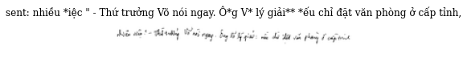

<a href="https://colab.research.google.com/github/pbcquoc/vietocr/blob/master/vietocr_gettingstart.ipynb" target="_parent"></a>


# Introduction
<p align="center">

</p>
This notebook describe how you can use VietOcr to train OCR model


```python
! pip install --quiet vietocr
```

         |████████████████████████████████| 61kB 1.8MB/s eta 0:00:011
    [?25h  Installing build dependencies ... [?25l[?25hdone
      Getting requirements to build wheel ... [?25l[?25hdone
        Preparing wheel metadata ... [?25l[?25hdone
         |████████████████████████████████| 880kB 7.2MB/s 
         |████████████████████████████████| 952kB 17.0MB/s 
    [?25h  Building wheel for gdown (PEP 517) ... [?25l[?25hdone
      Building wheel for lmdb (setup.py) ... [?25l[?25hdone
    ERROR: albumentations 0.1.12 has requirement imgaug<0.2.7,>=0.2.5, but you'll have imgaug 0.4.0 which is incompatible.
    

# Inference


```python
import matplotlib.pyplot as plt
from PIL import Image

from vietocr.tool.predictor import Predictor
from vietocr.tool.config import Cfg
```


```python
config = Cfg.load_config_from_name('vgg_transformer')
```

Change weights to your weights or using default weights from our pretrained model. Path can be url or local file


```python
# config['weights'] = './weights/transformerocr.pth'
config['weights'] = 'https://drive.google.com/uc?id=13327Y1tz1ohsm5YZMyXVMPIOjoOA0OaA'
config['cnn']['pretrained']=False
config['device'] = 'cuda:0'
config['predictor']['beamsearch']=False
```


```python
detector = Predictor(config)
```

    Cached Downloading: /root/.cache/gdown/https-COLON--SLASH--SLASH-drive.google.com-SLASH-uc-QUESTION-id-EQUAL-13327Y1tz1ohsm5YZMyXVMPIOjoOA0OaA
    Downloading...
    From: https://drive.google.com/uc?id=13327Y1tz1ohsm5YZMyXVMPIOjoOA0OaA
    To: /root/.cache/gdown/tmpdw3empzl/dl
    152MB [00:00, 187MB/s]
    


```python
! gdown --id 1uMVd6EBjY4Q0G2IkU5iMOQ34X0bysm0b
! unzip  -qq -o sample.zip
```

    Downloading...
    From: https://drive.google.com/uc?id=1uMVd6EBjY4Q0G2IkU5iMOQ34X0bysm0b
    To: /content/sample.zip
    100% 306k/306k [00:00<00:00, 85.7MB/s]
    


```python
! ls sample | shuf |head -n 5
```

    97652.jpg
    037188000873.jpeg
    30036.jpg
    461_PIGTAIL_57575.jpg
    030068003051.jpeg
    


```python
img = './sample/031189003299.jpeg'
img = Image.open(img)
plt.imshow(img)
s = detector.predict(img)
s
```


    'VŨ THUỲ NINH'


    

    


# Download sample dataset


```python
! gdown https://drive.google.com/uc?id=19QU4VnKtgm3gf0Uw_N2QKSquW1SQ5JiE
```

    Downloading...
    From: https://drive.google.com/uc?id=19QU4VnKtgm3gf0Uw_N2QKSquW1SQ5JiE
    To: /content/data_line.zip
    61.2MB [00:00, 67.2MB/s]
    


```python
! unzip -qq -o ./data_line.zip
```

# Train model


1.   Load your config
2.   Train model using your dataset above


Load the default config, we adopt VGG for image feature extraction


```python
from vietocr.tool.config import Cfg
from vietocr.model.trainer import Trainer
```

# Change the config 

* *data_root*: the folder save your all images
* *train_annotation*: path to train annotation
* *valid_annotation*: path to valid annotation
* *print_every*: show train loss at every n steps
* *valid_every*: show validation loss at every n steps
* *iters*: number of iteration to train your model
* *export*: export weights to folder that you can use for inference
* *metrics*: number of sample in validation annotation you use for computing full_sequence_accuracy, for large dataset it will take too long, then you can reuduce this number


```python
config = Cfg.load_config_from_name('vgg_transformer')
```


```python
#config['vocab'] = 'aAàÀảẢãÃáÁạẠăĂằẰẳẲẵẴắẮặẶâÂầẦẩẨẫẪấẤậẬbBcCdDđĐeEèÈẻẺẽẼéÉẹẸêÊềỀểỂễỄếẾệỆfFgGhHiIìÌỉỈĩĨíÍịỊjJkKlLmMnNoOòÒỏỎõÕóÓọỌôÔồỒổỔỗỖốỐộỘơƠờỜởỞỡỠớỚợỢpPqQrRsStTuUùÙủỦũŨúÚụỤưƯừỪửỬữỮứỨựỰvVwWxXyYỳỲỷỶỹỸýÝỵỴzZ0123456789!"#$%&\'()*+,-./:;<=>?@[\\]^_`{|}~ '

dataset_params = {
    'name':'hw',
    'data_root':'./data_line/',
    'train_annotation':'train_line_annotation.txt',
    'valid_annotation':'test_line_annotation.txt'
}

params = {
         'print_every':200,
         'valid_every':15*200,
          'iters':20000,
          'checkpoint':'./checkpoint/transformerocr_checkpoint.pth',    
          'export':'./weights/transformerocr.pth',
          'metrics': 10000
         }

config['trainer'].update(params)
config['dataset'].update(dataset_params)
config['device'] = 'cuda:0'
```

you can change any of these params in this full list below


```python
config
```


    {'backbone': 'vgg19_bn',
     'cnn': {'hidden': 256,
      'ks': [[2, 2], [2, 2], [2, 1], [2, 1], [1, 1]],
      'pretrained': True,
      'ss': [[2, 2], [2, 2], [2, 1], [2, 1], [1, 1]]},
     'dataloader': {'num_workers': 3, 'pin_memory': True},
     'dataset': {'data_root': './data_line/',
      'image_height': 32,
      'image_max_width': 512,
      'image_min_width': 32,
      'name': 'hw',
      'train_annotation': 'train_line_annotation.txt',
      'valid_annotation': 'test_line_annotation.txt'},
     'device': 'cuda:0',
     'optimizer': {'max_lr': 0.0003, 'pct_start': 0.1},
     'predictor': {'beamsearch': False},
     'pretrain': {'cached': '/tmp/tranformerorc.pth',
      'id_or_url': '13327Y1tz1ohsm5YZMyXVMPIOjoOA0OaA',
      'md5': 'af6b46e9295eb1c27ca90bddf8c8729a'},
     'quiet': False,
     'seq_modeling': 'transformer',
     'trainer': {'batch_size': 32,
      'checkpoint': './checkpoint/transformerocr_checkpoint.pth',
      'export': './weights/transformerocr.pth',
      'iters': 20000,
      'log': './train.log',
      'metrics': 10000,
      'print_every': 200,
      'valid_every': 3000},
     'transformer': {'d_model': 256,
      'dim_feedforward': 2048,
      'max_seq_length': 1024,
      'nhead': 8,
      'num_decoder_layers': 6,
      'num_encoder_layers': 6,
      'pos_dropout': 0.1,
      'trans_dropout': 0.1},
     'vocab': 'aAàÀảẢãÃáÁạẠăĂằẰẳẲẵẴắẮặẶâÂầẦẩẨẫẪấẤậẬbBcCdDđĐeEèÈẻẺẽẼéÉẹẸêÊềỀểỂễỄếẾệỆfFgGhHiIìÌỉỈĩĨíÍịỊjJkKlLmMnNoOòÒỏỎõÕóÓọỌôÔồỒổỔỗỖốỐộỘơƠờỜởỞỡỠớỚợỢpPqQrRsStTuUùÙủỦũŨúÚụỤưƯừỪửỬữỮứỨựỰvVwWxXyYỳỲỷỶỹỸýÝỵỴzZ0123456789!"#$%&\'()*+,-./:;<=>?@[\\]^_`{|}~ ',
     'weights': 'https://drive.google.com/uc?id=13327Y1tz1ohsm5YZMyXVMPIOjoOA0OaA'}


You should train model from our pretrained 


```python
trainer = Trainer(config, pretrained=True)
```

    Downloading: "https://download.pytorch.org/models/vgg19_bn-c79401a0.pth" to /root/.cache/torch/hub/checkpoints/vgg19_bn-c79401a0.pth
    


    HBox(children=(FloatProgress(value=0.0, max=574769405.0), HTML(value='')))


    
    

    Cached Downloading: /tmp/tranformerorc.pth
    Downloading...
    From: https://drive.google.com/uc?id=13327Y1tz1ohsm5YZMyXVMPIOjoOA0OaA
    To: /root/.cache/gdown/tmpy1fzi59f/dl
    152MB [00:00, 194MB/s]
    

    Computing MD5: /tmp/tranformerorc.pth
    MD5 matches: /tmp/tranformerorc.pth
    

    Create train_hw: 100%|████████████████████████████████████████| 5483/5483 [00:05<00:00, 1010.69it/s]
    

    Created dataset with 5482 samples
    

    train_hw build cluster: 100%|███████████████████████████████| 5482/5482 [00:00<00:00, 117812.82it/s]
    Create valid_hw: 100%|████████████████████████████████████████| 1813/1813 [00:01<00:00, 1175.19it/s]
    

    Created dataset with 1812 samples
    

    valid_hw build cluster: 100%|████████████████████████████████| 1812/1812 [00:00<00:00, 82383.00it/s]
    

Save model configuration for inference, load_config_from_file


```python
trainer.config.save('config.yml')
```

Visualize your dataset to check data augmentation is appropriate


```python
trainer.visualize_dataset()
```


    

    


    

    


    

    


    

    


    

    


    

    


    

    


    

    


    

    


    

    


    

    


    

    


    

    


    

    


    

    


    

    


Train now


```python
trainer.train()
```

    iter: 000200 - train loss: 1.657 - lr: 1.91e-05 - load time: 1.08 - gpu time: 158.33
    iter: 000400 - train loss: 1.429 - lr: 3.95e-05 - load time: 0.76 - gpu time: 158.76
    iter: 000600 - train loss: 1.331 - lr: 7.14e-05 - load time: 0.73 - gpu time: 158.38
    iter: 000800 - train loss: 1.252 - lr: 1.12e-04 - load time: 1.29 - gpu time: 158.43
    iter: 001000 - train loss: 1.218 - lr: 1.56e-04 - load time: 0.84 - gpu time: 158.86
    iter: 001200 - train loss: 1.192 - lr: 2.01e-04 - load time: 0.78 - gpu time: 160.20
    iter: 001400 - train loss: 1.140 - lr: 2.41e-04 - load time: 1.54 - gpu time: 158.48
    iter: 001600 - train loss: 1.129 - lr: 2.73e-04 - load time: 0.70 - gpu time: 159.42
    iter: 001800 - train loss: 1.095 - lr: 2.93e-04 - load time: 0.74 - gpu time: 158.03
    iter: 002000 - train loss: 1.098 - lr: 3.00e-04 - load time: 0.66 - gpu time: 159.21
    iter: 002200 - train loss: 1.060 - lr: 3.00e-04 - load time: 1.52 - gpu time: 157.63
    iter: 002400 - train loss: 1.055 - lr: 3.00e-04 - load time: 0.80 - gpu time: 159.34
    iter: 002600 - train loss: 1.032 - lr: 2.99e-04 - load time: 0.74 - gpu time: 159.13
    iter: 002800 - train loss: 1.019 - lr: 2.99e-04 - load time: 1.42 - gpu time: 158.27
    

Visualize prediction from our trained model


```python
trainer.visualize_prediction()
```

Compute full seq accuracy for full valid dataset


```python
trainer.precision()
```
